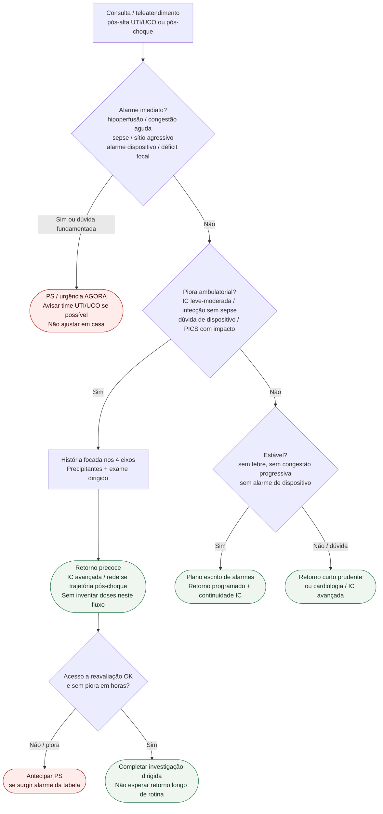

# Fluxograma ambulatorial: sinalizadores pós-UTI cardiológica — destino

Prosa: [`sinalizadores-ambulatoriais-pos-uti-choque-cardiogenico-quando-escalar`](sinalizadores-ambulatoriais-pos-uti-choque-cardiogenico-quando-escalar.md). Quatro eixos: [`sinalizadores-ambulatoriais-pos-alta-uti-infeccao-dispositivo-ic-cognicao`](sinalizadores-ambulatoriais-pos-alta-uti-infeccao-dispositivo-ic-cognicao.md).

## Árvore de decisão

## Notas

- **D1** = gate de segurança (hipoperfusão, congestão aguda, infecção grave, dispositivo, neurológico).
- **D2** = piora ambulatorial nos eixos infecção / dispositivo / IC / cognição → retorno precoce (HFA/ESC organização de cuidado; ESC HF 2021 continuidade).
- **Não decide** doses, vasoativos, indicação de MCS nem estadiamento SCAI.
