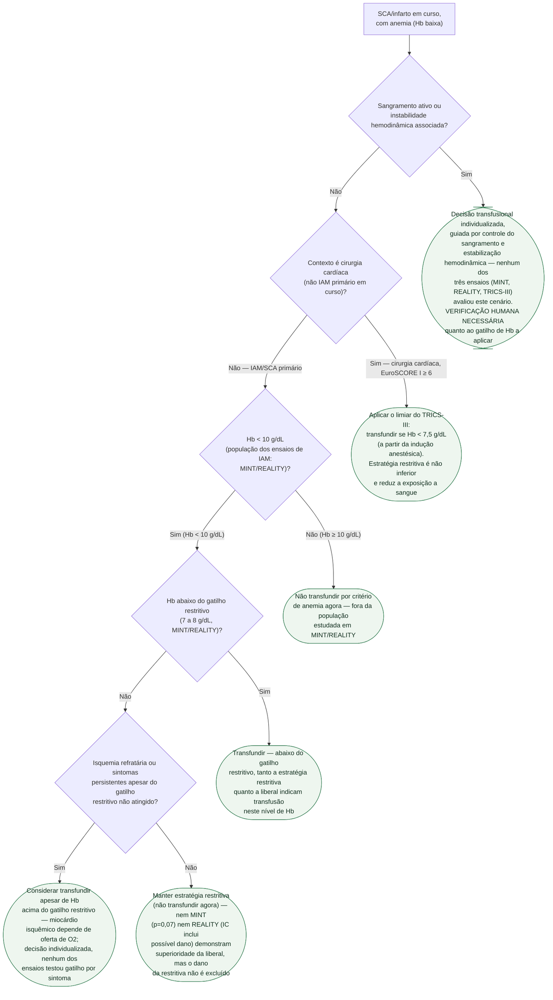

# Fluxograma: Anemia e decisão de transfusão no infarto

No paciente com SCA/infarto em curso e hemoglobina baixa, a decisão de
transfundir não segue o corte restritivo do resto da medicina — o miocárdio
isquêmico depende de oferta de oxigênio, e MINT e REALITY, os dois ensaios que
testaram a pergunta no infarto agudo, terminam sem resposta firme. A árvore
abaixo organiza essa decisão; o que se repete em qualquer ramo está em prosa
logo depois.

## Árvore de decisão

## O que se repete em todo ramo, e por isso não está no diagrama

**Reavaliação periódica.** A hemoglobina e o quadro isquêmico (dor, alterações
de ECG, instabilidade) são checados de novo a cada nova unidade transfundida
ou a cada piora clínica — a decisão não é tomada uma única vez na admissão.

**Tratamento do infarto em curso segue em paralelo**, pela via já estabelecida
para SCA (antiplaquetário, anticoagulação, estratégia de reperfusão) — este
fluxograma cobre só a decisão transfusional, não substitui o protocolo de SCA.

**Não estender o limiar do TRICS-III ao IAM primário**, e vice-versa: os
cortes restritivos diferem (7,5 g/dL na cirurgia cardíaca; 7-8 g/dL no
infarto) e os cenários fisiopatológicos não são intercambiáveis — por isso a
árvore separa os dois logo no início (nó D2).

**Nenhum dos três ensaios avalia isquemia ativa com instabilidade
hemodinâmica ou sangramento ativo.** Onde a árvore chega em C1, a literatura
citada não define um número — a conduta é clínica, à beira do leito.
