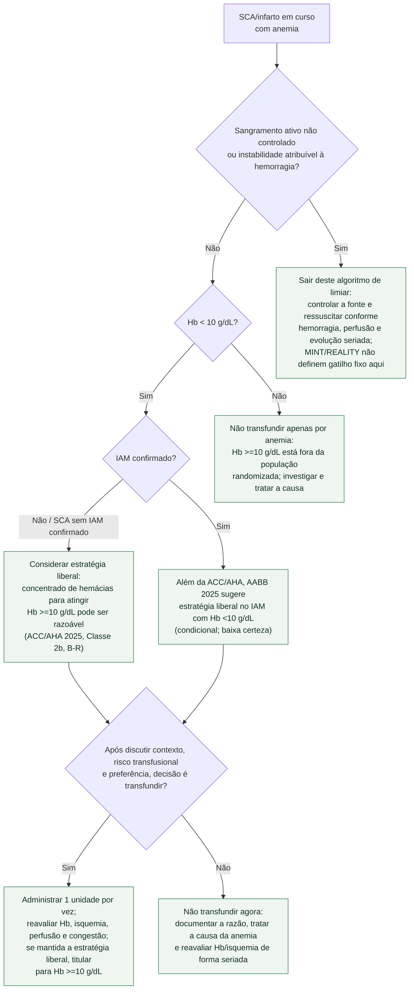

# Fluxograma: Anemia e decisão de transfusão no infarto

No paciente com síndrome coronariana aguda (SCA), a estratégia transfusional
restritiva usada rotineiramente em outras populações não deve ser importada de
forma automática. A diretriz ACC/AHA 2025 considera que transfundir para atingir
hemoglobina (Hb) **>=10 g/dL pode ser razoável** na SCA com anemia aguda ou
crônica (Classe 2b, B-R) quando não há sangramento ativo. A AABB 2025 vai na
mesma direção para o infarto agudo, porém sua recomendação é **condicional** e
baseada em evidência de **baixa certeza**.

Isso não transforma Hb <10 g/dL em ordem automática. Define uma estratégia a
ser considerada em conjunto com isquemia, tendência da Hb, risco de sobrecarga,
preferências do paciente e resposta a cada unidade.

## Árvore de decisão

## Como executar sem converter recomendação fraca em regra rígida

**Sangramento ativo é outro algoritmo.** MINT pausava o protocolo quando o
clínico julgava necessária transfusão imediata por sangramento, e excluiu
sangramento agudo não controlado que exigisse sangue não compatibilizado. A
orientação resumida da ACC/AHA para manter Hb em 10 g/dL também explicita a
ausência de sangramento ativo. Nesse cenário, uma Hb estática não substitui
controle da fonte, avaliação de perfusão e evolução seriada.

**Uma unidade e nova avaliação.** No MINT, ambos os grupos recebiam uma unidade
por vez, seguida de nova medida da Hb. Essa sequência reduz transfusão além do
necessário e permite interromper ou desacelerar diante de congestão, reação ou
mudança do quadro clínico. A estratégia liberal do ensaio mantinha Hb >=10
g/dL; a restritiva permitia transfusão abaixo de 8 g/dL, recomendava fortemente
abaixo de 7 g/dL e também permitia transfundir por angina persistente apesar de
tratamento medicamentoso.

**A recomendação atual favorece considerar a liberal, não obriga transfusão.**
O MINT não atingiu superioridade estatística no composto de morte ou reinfarto
em 30 dias (16,9% versus 14,5%; RR 1,15; IC95% 0,99-1,34; p=0,07), mas não
excluiu dano com a estratégia restritiva. A AABB agregou quatro ensaios e
concluiu que 7-8 g/dL pode aumentar mortalidade no IAM; ainda assim, classificou
a sugestão liberal como condicional e de baixa certeza, exigindo contexto além
da concentração de Hb.

**REALITY deve ser lido com a correção de 2026.** O cálculo original incluiu
indevidamente insuficiência cardíaca no composto primário e classificou quatro
retiradas de consentimento como ausência de evento. A correção reduziu os
eventos primários para 29 no grupo restritivo e 36 no liberal, sem mudar a
conclusão de não inferioridade em 30 dias. Isso não anula a incerteza clínica
nem transforma não inferioridade de um ensaio em recomendação universal.

**Cirurgia cardíaca não pertence a esta árvore.** O TRICS-III estudou o período
perioperatório de cirurgia cardíaca em pacientes de risco moderado a alto, não
o IAM primário em curso; o MINT excluiu cirurgia cardíaca prevista durante a
internação. O limiar de 7,5 g/dL do TRICS-III não deve ser usado como atalho no
ramo de SCA deste fluxograma.

## Tudo com Tudo

- [Diretriz ACC/AHA 2025 de síndrome coronariana aguda](../Doença_coronariana/acc-aha-2025-diretriz-sindrome-coronariana-aguda.md)
- [MINT: estratégia liberal versus restritiva no IAM com anemia](../Doença_coronariana/mint-transfusao-liberal-restritiva-iam-anemia.md)
- [Limiares de transfusão no cardiopata: MINT, REALITY e TRICS-III](limiar-de-transfusao-no-cardiopata-mint-reality-e-trics-iii.md)
- [Fluxograma de síndrome coronariana aguda — ESC 2023](../Doença_coronariana/fluxograma-sindrome-coronariana-aguda-esc-2023.md)
