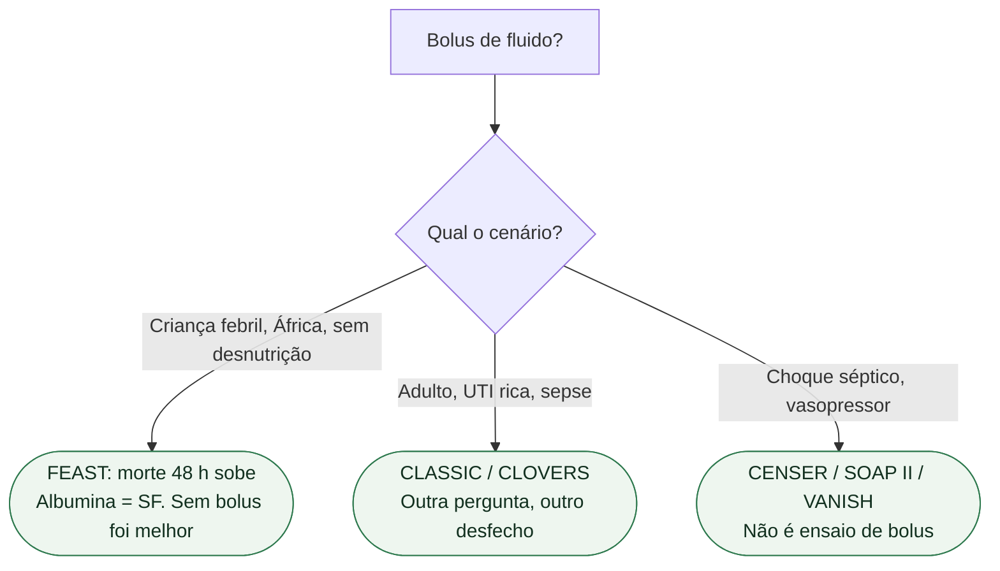

# Fluxograma: bolus de fluido — criança africana ≠ adulto

```mermaid
flowchart TD
  R0["Bolus de fluido?"] --> D1{"Qual o cenário?"}

  D1 -->|"Criança febril, África, sem desnutrição"| C1(["FEAST: morte 48 h sobe<br/>Albumina = SF. Sem bolus foi melhor"])

  D1 -->|"Adulto, UTI rica, sepse"| C2(["CLASSIC / CLOVERS<br/>Outra pergunta, outro desfecho"])

  D1 -->|"Choque séptico, vasopressor"| C3(["CENSER / SOAP II / VANISH<br/>Não é ensaio de bolus"])

  classDef conduta fill:#eef6ef,stroke:#2f7a4f,color:#12301f;
  class C1,C2,C3 conduta;
```

## Mensagem prática

**FEAST não autoriza bolus nesta criança.** Também não apaga CLASSIC. Não colapsar os três.
