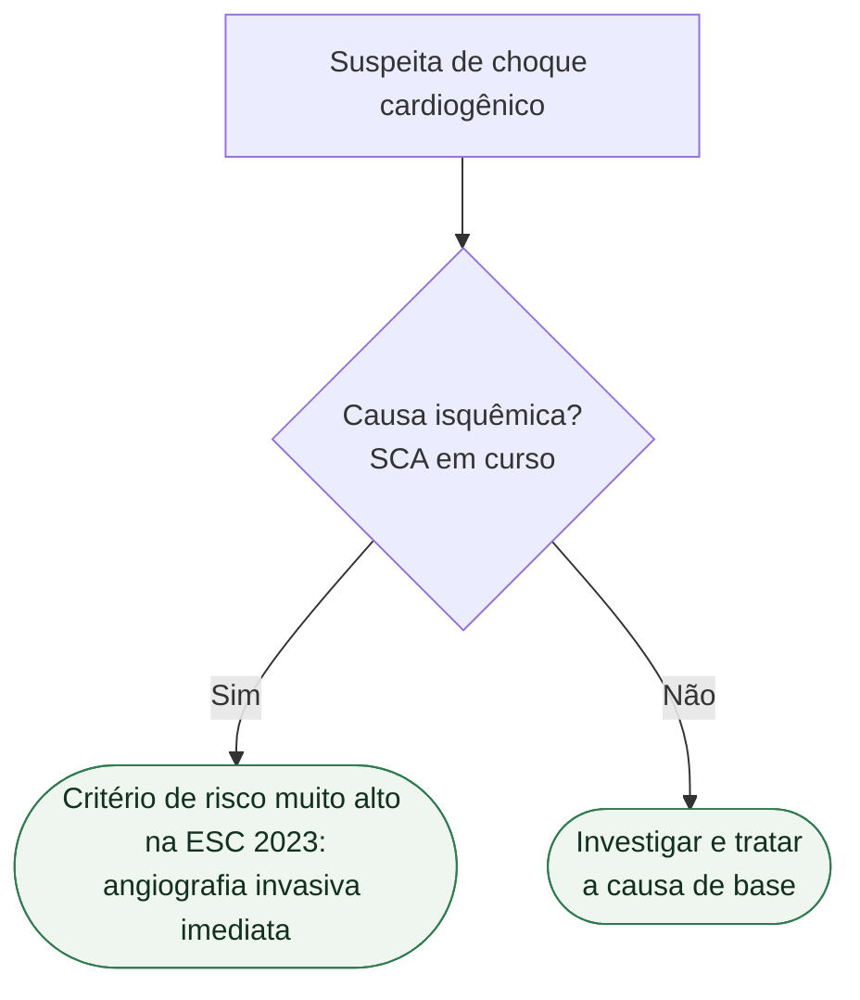
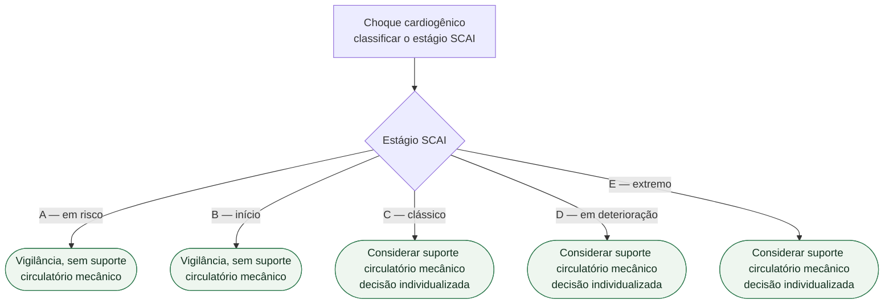

# Fluxograma: Choque Cardiogênico — estágios SCAI

O choque cardiogênico não é um estado binário. A classificação SCAI o organiza em
estágios de gravidade crescente, de **A a E**, e o eixo do manejo não é escolher
uma conduta definitiva no início, e sim **reavaliar com frequência** se o paciente
está melhorando ou deteriorando.

## Árvore de decisão: causa do choque

## Árvore de decisão: estágio SCAI e suporte circulatório

O estágio SCAI não é um rótulo fixo. A reavaliação frequente vale para todos os
estágios: quem deteriora é reclassificado e volta a percorrer a árvore acima;
quem melhora tem o suporte desescalonado conforme tolerado. É por isso que a
reavaliação não aparece como folha — ela é o que devolve o paciente à raiz.

## Mortalidade por estágio

No subestudo do ensaio ECLS-SHOCK, com 417 pacientes incluídos entre junho de
2019 e novembro de 2022 em choque cardiogênico relacionado a infarto agudo do
miocárdio, a distribuição e a mortalidade em 30 dias foram:

| Estágio SCAI | Proporção dos pacientes | Mortalidade em 30 dias |
|---|---:|---:|
| C — clássico | 51,6% | 32,6% |
| D — em deterioração | 13,4% | 67,9% |
| E — extremo | 35,0% | 64,4% |

O estágio SCAI, portanto, discrimina prognóstico de forma acentuada — a
mortalidade praticamente dobra do estágio C para o D.

## O que o ECLS-SHOCK mostrou sobre ECMO

Este é o maior ensaio de ECMO venoarterial em choque cardiogênico até o momento,
e o resultado é negativo: os achados **não sustentam uma estratégia de ECMO
venoarterial precoce de rotina** em comparação com terapia clínica.

Um ponto adicional do subestudo merece atenção: **não houve interação entre o
estágio SCAI e o efeito do tratamento** sobre a mortalidade em 30 dias nos
estágios C, D e E. Ou seja, a ausência de benefício não se explica por seleção de
estágio — não se identificou um estágio em que a estratégia precoce de rotina
passasse a compensar.

## Por que a reavaliação é o eixo

Em todos os estágios SCAI é necessária reavaliação frequente para determinar se
o paciente está melhorando ou deteriorando e se novas ações serão necessárias. O
estágio não é um rótulo fixo atribuído na admissão: é uma leitura que se repete,
e a trajetória entre leituras é o que orienta escalonar ou desescalonar suporte.
