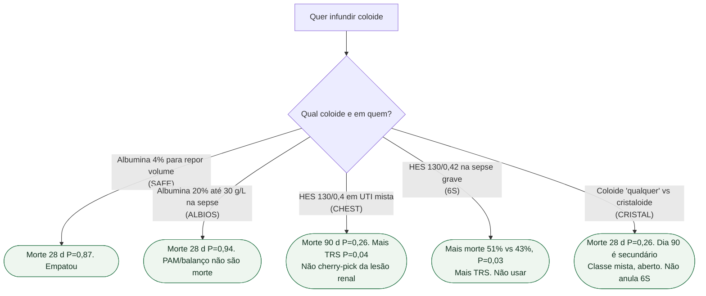

# Fluxograma: coloide na UTI?

```mermaid
flowchart TD
  R0["Quer infundir coloide"] --> D1{"Qual coloide e em quem?"}

  D1 -->|"Albumina 4% para repor volume<br/>(SAFE)"| C1(["Morte 28 d P=0,87. Empatou"])

  D1 -->|"Albumina 20% até 30 g/L na sepse<br/>(ALBIOS)"| C2(["Morte 28 d P=0,94. PAM/balanço não são morte"])

  D1 -->|"HES 130/0,4 em UTI mista<br/>(CHEST)"| C3(["Morte 90 d P=0,26. Mais TRS P=0,04<br/>Não cherry-pick da lesão renal"])

  D1 -->|"HES 130/0,42 na sepse grave<br/>(6S)"| C4(["Mais morte 51% vs 43%, P=0,03<br/>Mais TRS. Não usar"])

  D1 -->|"Coloide 'qualquer' vs cristaloide<br/>(CRISTAL)"| C5(["Morte 28 d P=0,26. Dia 90 é secundário<br/>Classe mista, aberto. Não anula 6S"])

  classDef conduta fill:#eef6ef,stroke:#2f7a4f,color:#12301f;
  class C1,C2,C3,C4,C5 conduta;
```

## Mensagem prática

**Amido na sepse mata mais (6S).** Albumina não salvou (SAFE/ALBIOS). CRISTAL não reabre coloide — o primário de 28 dias empatou.
