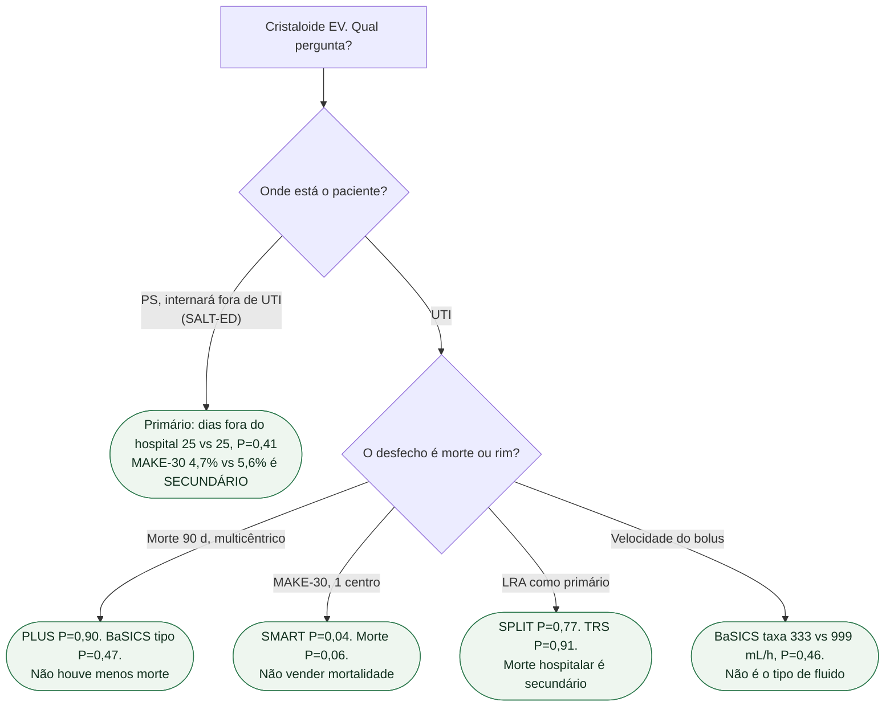

# Fluxograma: salina ou balanceado?

## Mensagem prática

**Morte 90 d empatou em PLUS e BaSICS.** SMART ganhou composto renal num centro. SALT-ED não mudou dias fora do hospital — o MAKE-30 do PS não é o primário.
