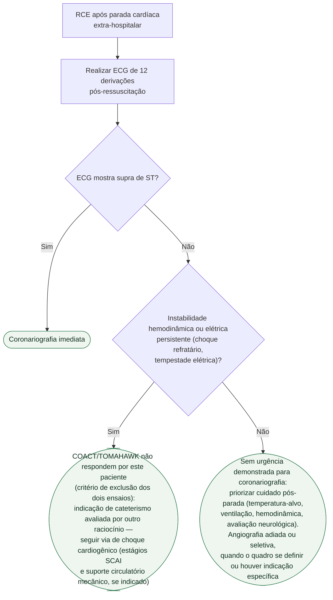

# Fluxograma: Cuidado pós-parada e decisão de coronariografia

O paciente teve retorno de circulação espontânea (RCE) após parada cardíaca
extra-hospitalar. O primeiro ECG pós-ressuscitação decide o ramo: com supra
de ST não há discussão, mas **sem supra de ST** — o cenário mais comum — a
decisão entre coronariografia imediata e adiada/seletiva é o que os ensaios
COACT e TOMAHAWK responderam, e nenhum dos dois favoreceu a estratégia
imediata.

## Árvore de decisão

## Cuidados gerais pós-parada, presentes nos dois ramos sem supra de ST

**Controle de temperatura-alvo.** Nem TTM nem TTM2 mostraram benefício de
hipotermia induzida sobre a alternativa comparada — o que a evidência atual
sustenta é **evitar febre**, não necessariamente induzir frio. O COACT ainda
mostrou que a estratégia de coronariografia imediata **atrasa** o tempo até
atingir a temperatura-alvo, um custo a considerar antes de levar o paciente à
hemodinâmica. Ver `controle-de-temperatura-pos-parada-cardiorrespiratoria-ttm-e-ttm2.md`,
nesta mesma pasta.

**Metas hemodinâmicas e de oxigenação, ventilação e avaliação neurológica
seriada** seguem em paralelo, independente do ramo da coronariografia — são
cuidado de suporte contínuo, não uma decisão binária única, e por isso não
entram como ramo da árvore.

## Por que a instabilidade muda a via

COACT e TOMAHAWK testaram pacientes ressuscitados sem sinais de instabilidade
que exigisse outra conduta imediata. **Nenhum dos dois respondeu sobre o
paciente em choque refratário ou tempestade elétrica** — nesses casos, a
indicação de cateterismo pode vir de outro raciocínio clínico, e o caminho é
o do choque cardiogênico (`classificacao-scai-de-estagios-do-choque-cardiogenico.md`
e `choque-cardiogenico-suporte-circulatorio-mecanico-temporario.md`, nesta
mesma pasta), não o desta árvore.

## Armadilha a evitar

Tratar o TOMAHAWK como neutro. O desfecho primário teve HR 1,28 (IC95%
1,00-1,63; p=0,06): formalmente não significativo, mas com os dois pontos
estimados acima de 1 e o intervalo tocando exatamente 1. A leitura correta
é **ausência de benefício da estratégia imediata, com um sinal desfavorável
que não se pode descartar** — não "tanto faz".
