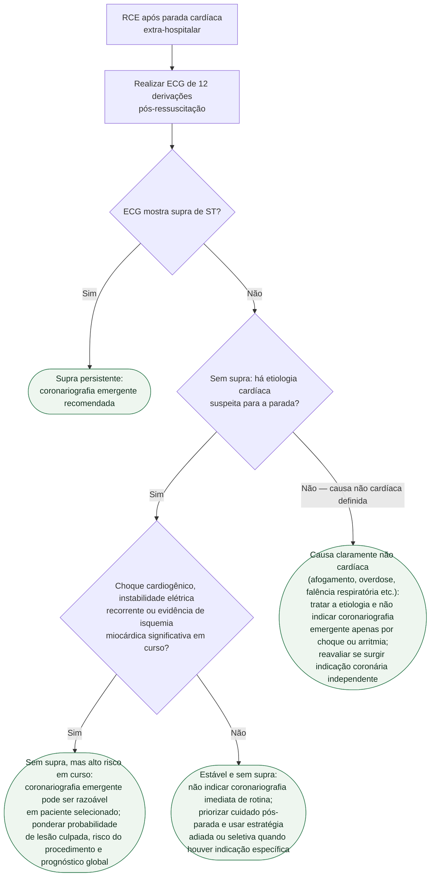

# Fluxograma: Cuidado pós-parada e decisão de coronariografia

O paciente teve retorno de circulação espontânea (RCE) após parada cardíaca
extra-hospitalar. O primeiro ECG pós-ressuscitação decide o ramo: com supra
persistente, angiografia emergente é recomendada; **sem supra de ST**, primeiro
é necessário haver **etiologia cardíaca suspeita**. Nesse grupo, choque,
instabilidade elétrica recorrente e isquemia em curso separam o paciente que
pode precisar de avaliação invasiva emergente daquele estável em que COACT e
TOMAHAWK não demonstraram benefício da estratégia imediata de rotina.

## Árvore de decisão

## Cuidados gerais pós-parada, presentes nos dois ramos sem supra de ST

**Controle protocolizado de temperatura.** TTM e TTM2 não demonstraram
superioridade da hipotermia induzida sobre os comparadores estudados; isso não
autoriza abandonar o controle de temperatura nem tolerar febre. O COACT ainda
mostrou que a estratégia de coronariografia imediata atrasou o tempo até a
temperatura-alvo. Ver
[Controle de temperatura pós-parada: TTM e TTM2](controle-de-temperatura-pos-parada-cardiorrespiratoria-ttm-e-ttm2.md).

**Metas hemodinâmicas e de oxigenação, ventilação e avaliação neurológica
seriada** seguem em paralelo, independente do ramo da coronariografia — são
cuidado de suporte contínuo, não uma decisão binária única, e por isso não
entram como ramo da árvore.

## Por que a instabilidade muda a via

COACT e TOMAHAWK testaram pacientes ressuscitados sem sinais de instabilidade
que exigissem outra conduta imediata. Portanto, seus resultados não devem ser
extrapolados ao choque, à instabilidade elétrica recorrente ou à isquemia em
curso. A AHA 2025 admite angiografia emergente como opção razoável em pacientes
selecionados **com etiologia cardíaca suspeita** desse ramo. Choque ou arritmia
após afogamento, overdose, falência respiratória ou outra causa claramente não
cardíaca não satisfazem isoladamente esse requisito. A estabilização segue conectada à
[classificação SCAI do choque](classificacao-scai-de-estagios-do-choque-cardiogenico.md)
e ao [suporte circulatório mecânico temporário](choque-cardiogenico-suporte-circulatorio-mecanico-temporario.md).

## Armadilha a evitar

Tratar o TOMAHAWK como neutro. O desfecho primário teve HR 1,28 (IC95%
1,00-1,63; p=0,06): formalmente não significativo, mas com os dois pontos
estimados acima de 1 e o intervalo tocando exatamente 1. A leitura correta
é **ausência de benefício da estratégia imediata, com um sinal desfavorável
que não se pode descartar** — não "tanto faz".
