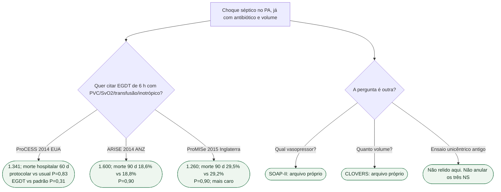

# Fluxograma: EGDT protocolar no choque séptico?

## Mensagem prática

**Três multicêntricos, primário de morte NS.** Não protocolar CVC/SvO2/transfusão/dobutamina como se isso reduzisse mortalidade contemporânea.
