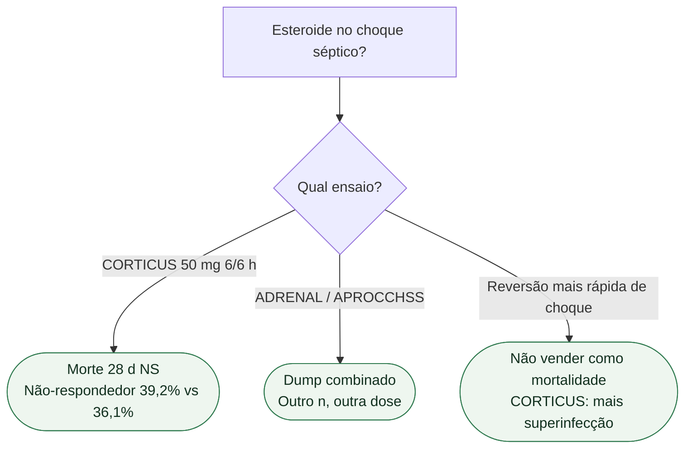

# Fluxograma: CORTICUS não é ADRENAL

```mermaid
flowchart TD
  R0["Esteroide no choque séptico?"] --> D1{"Qual ensaio?"}

  D1 -->|"CORTICUS 50 mg 6/6 h"| C1(["Morte 28 d NS<br/>Não-respondedor 39,2% vs 36,1%"])

  D1 -->|"ADRENAL / APROCCHSS"| C2(["Dump combinado<br/>Outro n, outra dose"])

  D1 -->|"Reversão mais rápida de choque"| C3(["Não vender como mortalidade<br/>CORTICUS: mais superinfecção"])

  classDef conduta fill:#eef6ef,stroke:#2f7a4f,color:#12301f;
  class C1,C2,C3 conduta;
```
