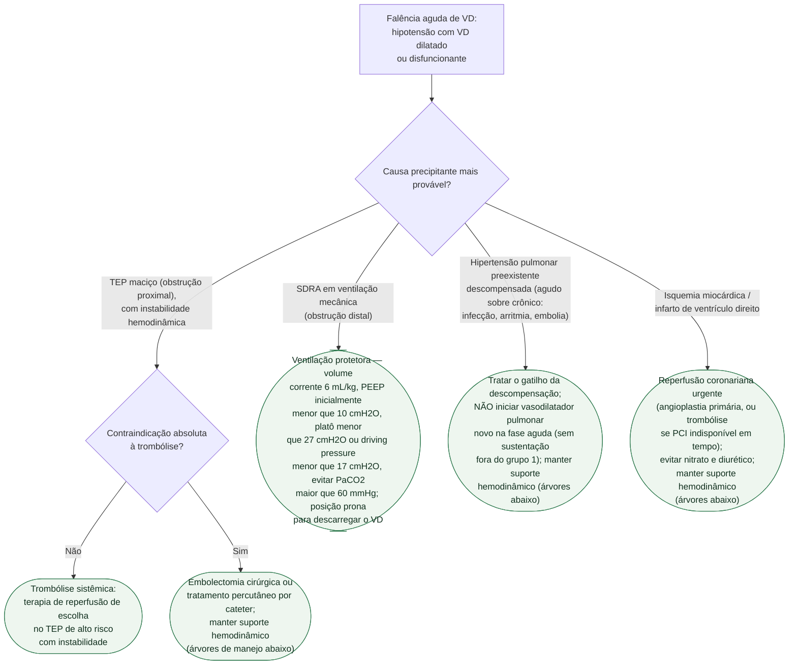
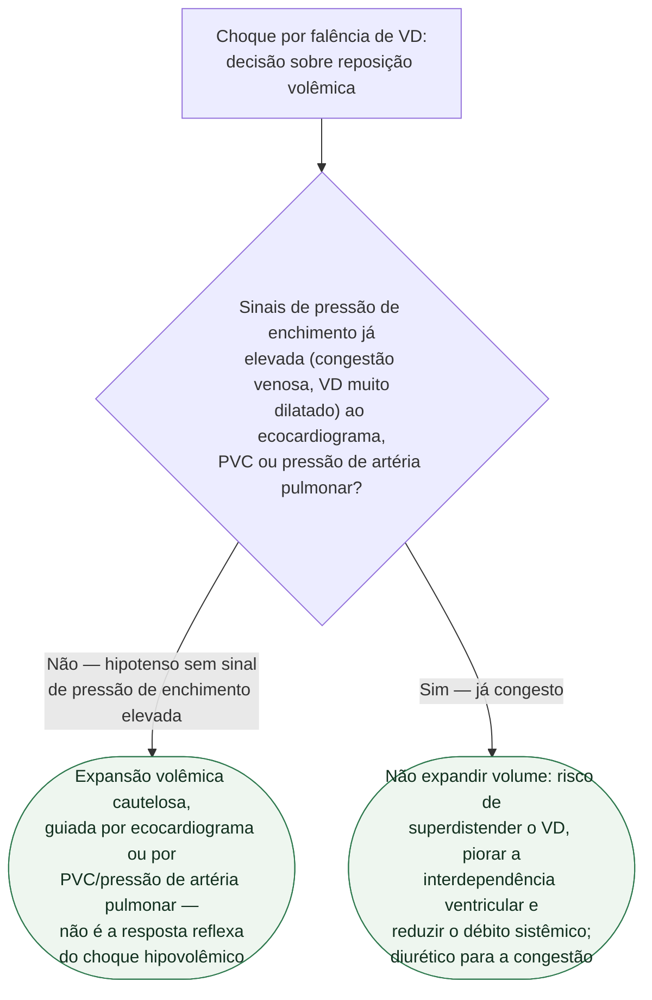
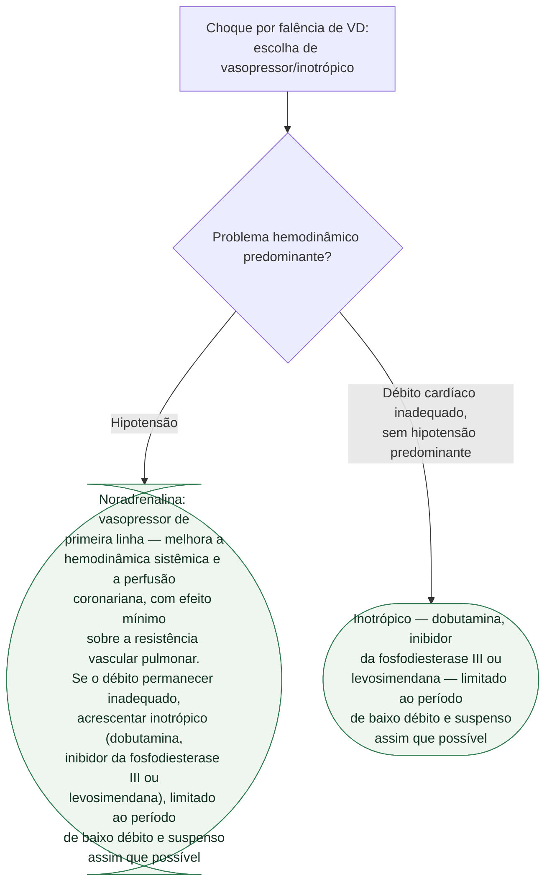
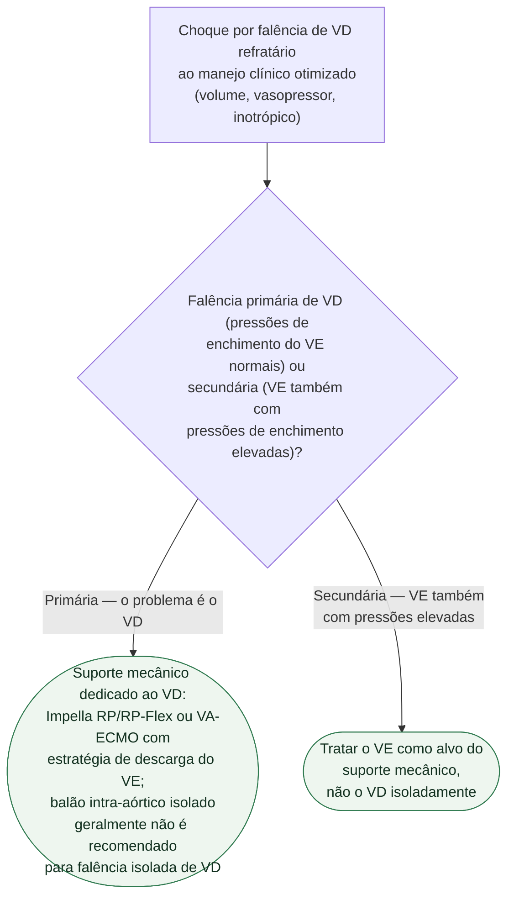

# Fluxograma: Falência Aguda de Ventrículo Direito

O ventrículo direito é uma câmara de parede fina, adaptada a trabalhar contra
resistência baixa. Aumento **agudo** de pós-carga o faz dilatar, aumentar a
tensão de parede e entrar num ciclo que a conduta reflexa do choque
hipovolêmico **piora** — dar volume por reflexo diante de hipotensão é o erro
mais citado no consenso ACVC/ESC 2024. Por isso a primeira pergunta é a causa
precipitante, porque ela muda a conduta; a segunda é se o paciente responde a
volume ou já está congesto, nunca o oposto.

## Árvore de decisão: causa precipitante

No TEP maciço, oxigenoterapia por cânula nasal de alto fluxo deve ser usada
inicialmente, e a intubação evitada quando possível: a ventilação mecânica
associou-se a risco de mortalidade **três vezes maior** nesse grupo, e muitos
sedativos usados na indução podem agravar a instabilidade hemodinâmica.

## Árvore de decisão: reposição volêmica no choque de VD

## Árvore de decisão: vasopressor e inotrópico

## Árvore de decisão: suporte circulatório mecânico

Sinais de que o choque de VD está indo mal e merece essa reavaliação: mais de
48 horas de suporte inotrópico, escore vasoativo-inotrópico acima de 20,
pressões de enchimento persistentemente elevadas, congestão pulmonar e piora
do lactato apesar de volume e drogas vasoativas otimizados.

## O que vale em qualquer causa, e por isso não está na árvore

**Ventilação com pressão positiva piora o VD, sempre.** A pressão positiva
eleva a resistência vascular pulmonar e a pressão intratorácica, reduzindo o
retorno venoso e a pré-carga do VD — a PEEP alta "para melhorar a oxigenação"
tem esse custo em qualquer causa, não só na SDRA. Hipoxemia, hipercapnia e
acidose são vasoconstritoras pulmonares com efeito sinérgico e alimentam o
mesmo ciclo. Evitar ventilação mecânica desnecessária é, portanto, uma
diretriz geral.

**Inotrópico é para o período de baixo débito, não além dele.** O consenso é
explícito: pelos efeitos deletérios potenciais, o uso deve se limitar ao baixo
débito e ser interrompido o mais cedo possível — manter a infusão depois de
resolvido o problema é a armadilha mais comum de escalonamento.

**Vasodilatador pulmonar específico fora do grupo 1 da OMS não tem uso
rotineiro sustentado pela evidência atual**, em nenhuma das causas — inclusive
na hipertensão pulmonar descompensada.

**Reavaliação contínua.** O estágio do choque não é um rótulo fixo da
admissão; quem deteriora volta a percorrer as árvores acima, e quem melhora
tem o suporte desescalonado conforme tolerado.

## Documentos relacionados

`classificacao-scai-de-estagios-do-choque-cardiogenico.md`,
`cateter-de-arteria-pulmonar-no-choque-cardiogenico-escape-e-o-limite-do-dado-observacional.md`,
`choque-cardiogenico-suporte-circulatorio-mecanico-temporario.md`,
`vasopressores-adjuvantes-no-choque-vasodilatador-vasst-vanish-e-athos-3.md` e
`ecmo-venoarterial-no-choque-cardiogenico-do-infarto-ecls-shock-ecmo-cs-e-a-metanalise-de-dados-individuais.md`,
todos nesta mesma pasta. O TEP de alto risco tem fluxograma dedicado em
`fluxograma-tromboembolismo-pulmonar-diagnostico-esc-2019.md`, em
Tromboembolismo.
