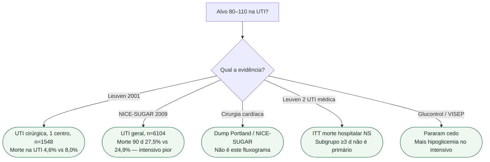

# Fluxograma: alvo glicêmico na UTI

```mermaid
flowchart TD
  R0["Alvo 80–110 na UTI?"] --> D1{"Qual a evidência?"}

  D1 -->|"Leuven 2001"| C1(["UTI cirúrgica, 1 centro, n=1548<br/>Morte na UTI 4,6% vs 8,0%"])

  D1 -->|"NICE-SUGAR 2009"| C2(["UTI geral, n=6104<br/>Morte 90 d 27,5% vs 24,9% — intensivo pior"])

  D1 -->|"Cirurgia cardíaca"| C3(["Dump Portland / NICE-SUGAR<br/>Não é este fluxograma"])

  D1 -->|"Leuven 2 UTI médica"| C4(["ITT morte hospitalar NS<br/>Subgrupo ≥3 d não é primário"])

  D1 -->|"Glucontrol / VISEP"| C5(["Pararam cedo<br/>Mais hipoglicemia no intensivo"])

  classDef conduta fill:#eef6ef,stroke:#2f7a4f,color:#12301f;
  class C1,C2,C3,C4,C5 conduta;
```
