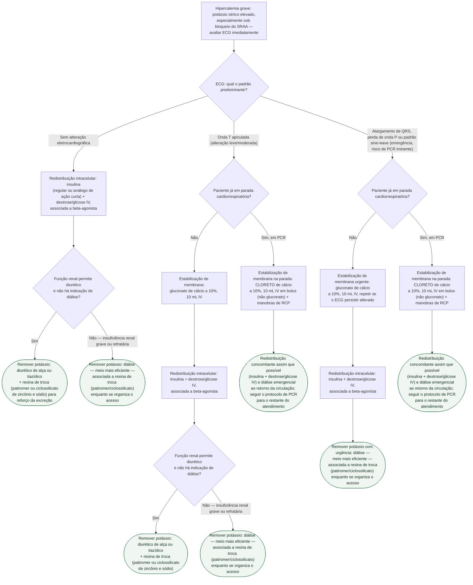

# Hipercalemia grave

Gatilho para este protocolo: **potássio sérico elevado**, **alteração no ECG**
ou **paciente sob bloqueio do SRAA** com hipercalemia. O eixo que separa as
condutas não é o número do potássio isolado — é **o padrão do ECG**, do
paciente sem alteração até o sine-wave, que é emergência com risco de parada
cardiorrespiratória (PCR) iminente.

## Árvore de decisão

## O que vale para todos os ramos, e por isso não está no diagrama

**Nunca usar poliestirenossulfonato de sódio** na hipercalemia aguda — a
revisão de Long et al. afirma literalmente que ele **não é eficaz**, apesar de
ainda ser prescrito por hábito na emergência.

**Monitorização seriada de glicemia** durante e depois da insulina IV, pela
hipoglicemia. **Potássio e ECG seriados** em todos os ramos, para reavaliar a
resposta e a necessidade de repetir a estabilização de membrana.

**Tratar a causa**: revisar e, em geral, suspender temporariamente o
bloqueador do SRAA que motivou ou agravou a hipercalemia, e investigar outras
causas (lesão renal aguda, rabdomiólise, acidose, hemólise) em paralelo ao
tratamento agudo.
