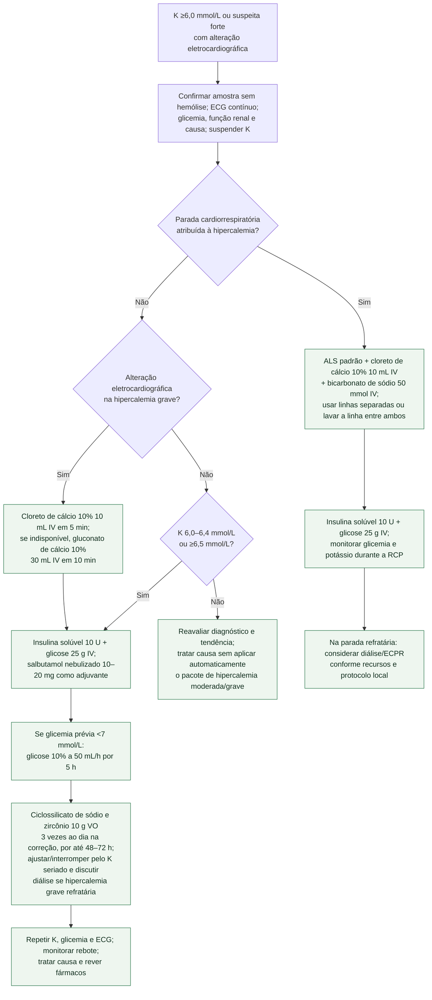

# Hipercalemia aguda no adulto

Usar este fluxo no **adulto** com potássio confirmado de 6,0 mmol/L ou mais,
ou com alteração eletrocardiográfica compatível e forte suspeita clínica. Repetir
imediatamente uma amostra possivelmente hemolisada, mas não atrasar tratamento se
há instabilidade, alteração de condução ou parada. Suspender fontes de potássio,
obter ECG de 12 derivações e iniciar monitorização contínua.

## Árvore de decisão

## O que cada etapa faz

- **Cálcio estabiliza a membrana; não remove potássio.** Na hipercalemia grave
  com alteração eletrocardiográfica, o algoritmo ERC/RCUK 2025 prefere 10 mL de
  cloreto de cálcio a 10% em 5 minutos. Quando o cloreto não está disponível,
  a dose alternativa é 30 mL de gluconato a 10% em 10 minutos. Não tratar os
  dois volumes como equivalentes frasco a frasco.
- **Insulina/glicose desloca potássio para dentro da célula.** Salbutamol é
  adjuvante e não substitui insulina/glicose. Verificar glicemia repetidamente;
  a infusão de glicose após o bólus é indicada pelo algoritmo quando a glicemia
  pré-tratamento é inferior a 7 mmol/L.
- **Remoção é necessária para evitar rebote.** O algoritmo 2025 inclui
  ciclossilicato de sódio e zircônio no regime de correção de **10 g por via
  oral três vezes ao dia**, por até 48–72 horas conforme resposta e protocolo,
  com potássio seriado para ajustar ou interromper após a correção; não se trata
  de uma dose única. Recomenda-se considerar diálise na hipercalemia grave
  refratária. Diurético só é pertinente quando há
  diurese e contexto volêmico apropriado; não é um degrau obrigatório.
- **Patiromer não pertence ao resgate imediato.** Seu início de ação é tardio e
  a bula não o indica como tratamento emergencial da hipercalemia com risco de
  vida. Poliestirenossulfonato também não substitui as intervenções de ação
  rápida nem a diálise quando esta é necessária.

## Limites de segurança

Este fluxo não autoriza repetir cálcio indefinidamente nem prescrever insulina
sem monitorização de glicose e potássio. Alterações eletrocardiográficas são
insensíveis: um ECG aparentemente normal não torna seguro observar um paciente
com potássio muito elevado. A decisão de diálise considera refratariedade,
função renal, acidose, sobrecarga, catabolismo e possibilidade de rebote.

Na intoxicação digitálica, hiperpotassemia pode indicar fragmentos Fab; seguir o
fluxo específico e acionar toxicologia, em vez de transportar automaticamente
toda esta sequência. Em criança, usar protocolo pediátrico próprio; as doses e
as recomendações da parada adulta acima não devem ser convertidas por peso.

## Tudo com Tudo

- [Fluxograma de parada cardiorrespiratória no adulto](/biblioteca/fluxograma-parada-cardiorrespiratoria-ritmo-inicial)
- [Fluxograma de intoxicação digitálica](/biblioteca/fluxograma-intoxicacao-digitalica)
- [Síndrome BRASH](/biblioteca/sindrome-brash-bradicardia-insuficiencia-renal-bloqueio-av-choque-e-hipercalemia)
- [Ciclossilicato de sódio e zircônio na hipercalemia](/biblioteca/ciclossilicato-de-sodio-e-zirconio-szc-na-hipercalemia-o-ensaio-harmonize)
- [Patiromer e bloqueio do SRAA no DIAMOND](/biblioteca/hipercalemia-como-barreira-ao-bloqueio-do-sraa-o-ensaio-diamond-com-patiromer)
- [Hipercalemia e intoxicação por betabloqueador/BCC](/biblioteca/hipercalemia-grave-e-intoxicacao-por-betabloqueador-ou-bloqueador-de-canal-de-calcio)
