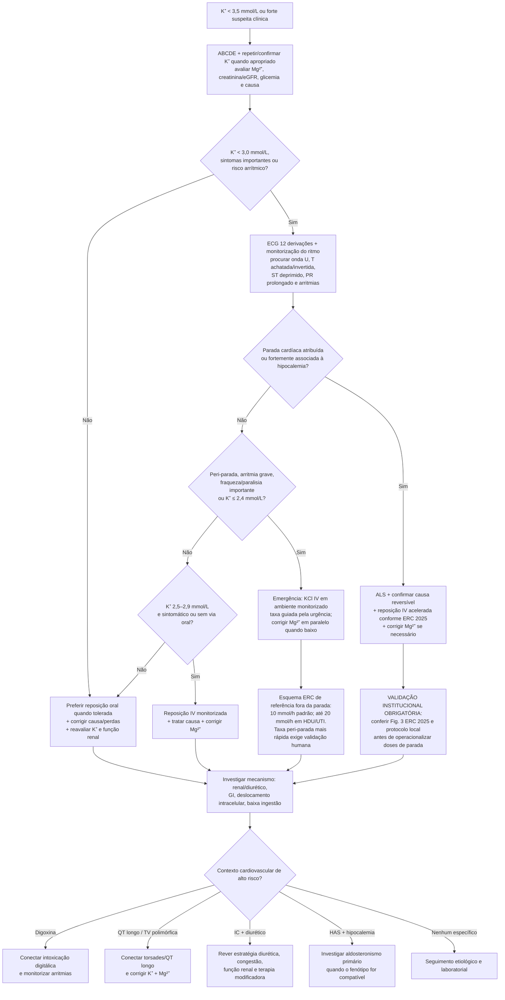

# Hipocalemia grave e risco arrítmico

> **STATUS DE CURADORIA: `revisado`.** Este fluxo mantém os esquemas de reposição acelerada isolados nos ramos peri-parada/parada e não deve ser usado como prescrição automática.

## Árvore de decisão

## Regras de segurança do fluxo

- **ECG e sintomas têm peso decisivo**; o valor isolado não captura todo o risco.
- A ERC 2025 recomenda ECG de 12 derivações e monitorização do ritmo quando **K⁺ <3,0 mmol/L**.
- **Magnésio baixo deve ser corrigido em paralelo.** Deficiência de magnésio agrava a hipocalemia e o risco elétrico.
- Reposição oral é preferível no paciente estável que tolera a via oral.
- Reposição IV rápida exige bomba, acesso apropriado, ECG e controles seriados; **não transformar esquemas de peri-parada/parada em rotina de enfermaria**.
- O alvo operacional de **K⁺ 4,0 mmol/L** aparece no algoritmo ERC 2025 para a correção aguda; não deve ser interpretado como meta rígida universal crônica.

## Doses de alto risco que NÃO entram no diagrama operacional

A Fig. 3 da ERC 2025 contém esquemas acelerados para peri-parada e parada hipocalêmica. Eles estão descritos no módulo `hipocalemia-grave-risco-arritmico-e-reposicao-segura`, mas permanecem sob **VALIDAÇÃO INSTITUCIONAL OBRIGATÓRIA** porque erro de contexto, concentração ou velocidade pode causar dano grave.

## Conectar no CorVIA

- `hipocalemia-grave-risco-arritmico-e-reposicao-segura`
- `torsades-de-pointes-e-qt-longo-adquirido-escore-de-tisdale-e-manejo-agudo`
- `intoxicacao-digitalica-manejo-agudo-e-anticorpo-antidigoxina-fab`
- `estrategia-diuretica-na-insuficiencia-cardiaca-aguda-descompensada`
- `aldosteronismo-primario-e-feocromocitoma-testes-confirmatorios-endocrine-society`
- `hiperaldosteronismo-primario-subdiagnosticado-prevalencia-real-e-rastreio-por-arr`

## Limites de evidência

A ERC 2025 é a fonte operacional mais atual encontrada para a situação aguda, mas o próprio documento esclarece que vários temas de circunstâncias especiais não foram submetidos a revisão ILCOR específica e que parte das recomendações é consenso do grupo apoiado por revisões adicionais/literatura selecionada. A revisão ESC 2021 sobre hipocalemia cardiovascular enfatiza que metas, frequência de monitorização e alguns detalhes de reposição carecem de ensaios randomizados robustos.
