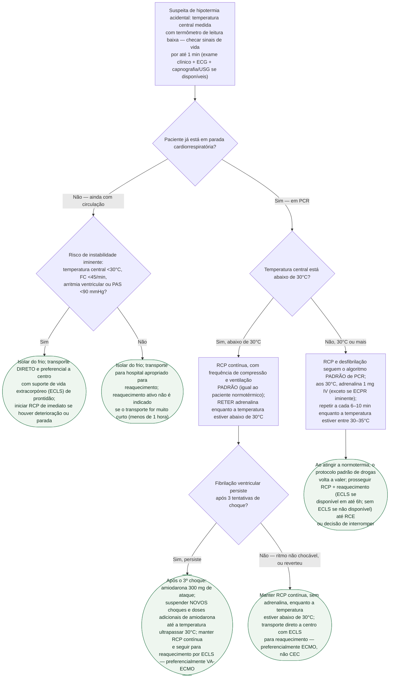

# Hipotermia acidental e parada cardiorrespiratória

Gatilho para este protocolo: **temperatura central medida <35 °C** (termômetro
de leitura baixa — timpânico se respiração espontânea, esofágico se via
aérea avançada), por exposição ao frio ou causa secundária. O eixo que
separa as condutas é, primeiro, **se o paciente já está em parada
cardiorrespiratória (PCR)** e, dentro da PCR, **se a temperatura central está
abaixo ou acima de 30 °C** — o corte que decide reter ou liberar a
adrenalina e adiar ou não novos choques em fibrilação ventricular (FV)
refratária.

## Árvore de decisão

## O que vale para todos os ramos, e por isso não está no diagrama

**Na hipotermia primária, PCR não testemunhada com assistolia como ritmo
inicial não é contraindicação** ao reaquecimento por ECLS.

**Em pacientes com temperatura abaixo de 28 °C**, RCP retardada pode ser
usada quando a RCP no local for perigosa demais ou inviável, e RCP
intermitente quando a contínua não for possível — é uma modificação
circunstancial (segurança do local), não um ramo clínico da árvore.

**Resgate em avalanche** segue regra própria, à parte deste fluxograma
geral: soterramento **menor que 60 minutos** é manejado como paciente
normotérmico (suporte avançado de vida padrão por, no mínimo, 20 minutos);
soterramento **maior que 60 minutos sem lesão claramente não sobrevivível**
recebe reanimação completa com reaquecimento por ECLS; soterramento **maior
que 60 minutos com via aérea obstruída** pode ter a RCP considerada fútil.
Dar 5 ventilações iniciais na parada por avalanche, porque a hipóxia é a
causa mais provável.

**Prognóstico e triagem**: o escore HOPE (Hypothermia Outcome Prediction
after ECLS rewarming — idade, sexo, temperatura central, potássio sérico,
presença de asfixia, duração da RCP) é o mais bem validado para estimar a
probabilidade de sobrevida antes de decidir reaquecer por ECLS, e é mais
confiável que a triagem tradicional por potássio sérico isolado.

**Nunca declarar óbito por inspeção rápida** no paciente profundamente
hipotérmico — ele pode parecer morto e ainda sobreviver à reanimação.
