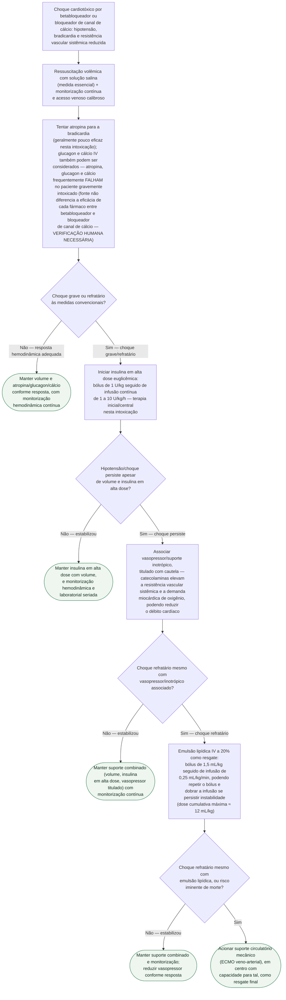

# Intoxicação por betabloqueador ou antagonista de cálcio

Gatilho para este protocolo: **bradicardia com hipotensão refratária** ou
**choque cardiogênico** em paciente com ingestão ou uso de **betabloqueador**
ou **bloqueador de canal de cálcio**. O reflexo convencional (atropina,
glucagon, cálcio) costuma decepcionar no paciente gravemente intoxicado — o
que muda o desfecho é a **insulina em alta dose euglicêmica**, considerada
terapia inicial/central pela revisão de Engebretsen et al.

## Árvore de decisão

## O que vale para todos os ramos, e por isso não está no diagrama

**Ressuscitação salina** mantida ao longo de todo o atendimento, não só na
medida inicial — é o que corrige a vasodilatação e as pressões de enchimento
baixas.

**Monitorização seriada de glicemia e potássio** durante toda a infusão de
insulina em alta dose. A suplementação de glicose provavelmente será
necessária durante toda a terapia e **por até 24 horas após a suspensão** da
infusão, pelo risco de hipoglicemia tardia. **A queda do potássio sob
insulina reflete deslocamento para o intracelular, não depleção dos
estoques corporais** — não repor de forma agressiva.

**A base de evidência da insulina em alta dose é animal e de relatos/séries
de casos** — não há ensaio clínico controlado publicado em humanos. Em
modelos animais, a insulina em alta dose mostrou-se superior a sais de
cálcio, glucagon, epinefrina e vasopressina em sobrevida.

**Emulsão lipídica e ECMO usadas ao mesmo tempo** exigem atenção ao circuito
— há relato de camadas, aglutinação e formação de coágulos na linha quando
as duas terapias correm juntas.

## Limites

- **A revisão-base da parte de insulina é de 2011** e declara explicitamente
  que não há ensaio clínico controlado em humanos para essa terapia.
- **O documento-fonte não diferencia a eficácia de atropina, glucagon e
  cálcio IV entre betabloqueador e bloqueador de canal de cálcio** — este
  fluxograma trata os três como classe geral nesse ponto; a diferenciação
  farmacológica clássica (por exemplo, glucagon atuando por via não
  beta-adrenérgica, mais relevante no betabloqueador) não veio das fontes
  consultadas para este documento e precisa de **VERIFICAÇÃO HUMANA
  NECESSÁRIA** antes de orientar conduta.
- **Emulsão lipídica e ECMO vêm de fontes novas**, pesquisadas especificamente
  para este fluxograma porque o documento-fonte de hipercalemia/intoxicação
  não cobre resgate em choque refratário — conferir a posologia da emulsão
  lipídica e os critérios de acionamento de ECMO do serviço antes de aplicar.
