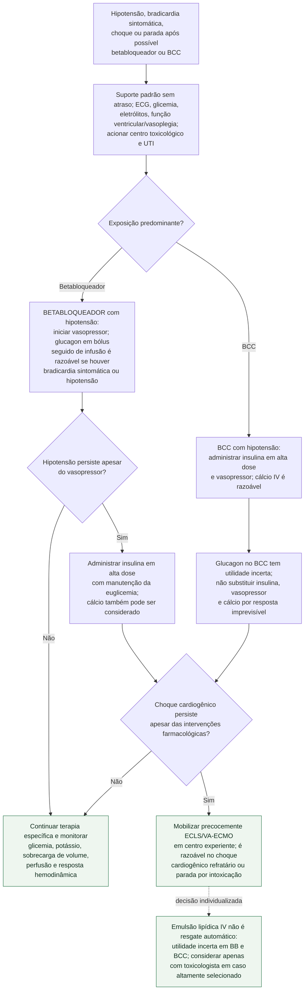

# Intoxicação por betabloqueador ou antagonista de cálcio

Este fluxo é para **hipotensão, bradicardia sintomática, choque ou parada com
risco de vida** após exposição a betabloqueador ou bloqueador de canal de cálcio
(BCC). Suporte básico/avançado, ventilação, monitorização, acesso vascular e
contato imediato com centro de informação toxicológica devem ocorrer em
paralelo. Atropina e marca-passo podem ser tentados conforme o algoritmo de
bradicardia, mas têm resposta variável e não devem atrasar a terapia dirigida.

## Árvore de decisão

## Por que os ramos não podem ser fundidos

Na intoxicação por **betabloqueador**, a AHA 2025 recomenda vasopressor para
hipotensão (Classe 1, C-EO), considera razoável glucagon em bólus seguido de
infusão para bradicardia sintomática ou hipotensão (Classe 2a, C-LD) e posiciona
insulina em alta dose quando a hipotensão permanece refratária ao vasopressor
(Classe 1, C-LD). Cálcio pode ser considerado, mas seu apoio vem de casos
confundidos por tratamentos simultâneos (Classe 2b, C-EO).

Na intoxicação por **BCC**, insulina em alta dose (Classe 1, B-NR) e vasopressor
(Classe 1, C-LD) são recomendados para hipotensão; cálcio é razoável (Classe 2a,
C-EO). A utilidade de glucagon em bólus seguido de infusão é **incerta**
(Classe 2b, C-EO). Portanto, escrever que “glucagon e cálcio frequentemente
falham” em ambas as intoxicações apaga diferenças que mudam a sequência.

## Insulina em alta dose: controles inseparáveis

Insulina em alta dose exige protocolo com dextrose e monitorização frequente de
glicemia e potássio. Hipoglicemia, hipocalemia e sobrecarga de volume são riscos
explicitamente apontados pela AHA. O potássio pode cair por deslocamento
intracelular; reposição e velocidade de correção dependem de concentração,
arritmia e protocolo, não de um reflexo automático.

Este fluxograma deliberadamente não replica dose, concentração ou velocidade de
infusão. A prescrição deve ser conferida no protocolo institucional e com o
centro toxicológico, porque envolve insulina em ordem de grandeza muito superior
ao uso metabólico habitual, dextrose titulada e diferentes sais de cálcio. O
documento específico de intoxicação por BCC do acervo contém a tabela
farmacológica e a graduação do consenso de 2017.

## Resgate e limites

- ECLS/VA-ECMO é razoável quando o choque cardiogênico permanece refratário às
  intervenções farmacológicas: Classe 2a, C-LD no betabloqueador adulto e
  Classe 2a, B-NR no BCC adulto. A mobilização deve começar antes do colapso
  irreversível.
- A utilidade da emulsão lipídica intravenosa é incerta tanto no betabloqueador
  quanto no BCC (Classe 2b, C-EO). A AHA registra relatos de parada abrupta após
  sua administração; ela não deve ocupar automaticamente um degrau obrigatório
  antes da ECMO.
- Atenolol, nadolol e sotalol podem ser dialisáveis em intoxicação grave; essa
  possibilidade depende do agente e não se aplica à classe inteira.
- Propranolol pode causar bloqueio de canal de sódio e QRS largo; sotalol pode
  prolongar repolarização. Esses fenótipos exigem terapias elétricas/toxicológicas
  adicionais e não cabem no ramo hemodinâmico genérico.
- Reposição volêmica deve ser guiada por responsividade e congestão. Insistir em
  salina como medida “essencial” contínua pode piorar sobrecarga sem corrigir a
  depressão miocárdica.

## Tudo com Tudo

- [Diretriz AHA 2025 de intoxicações cardiotóxicas graves](../Farmacologia/diretriz-aha-2025-intoxicacoes-cardiotoxicas-graves.md)
- [Intoxicação grave por bloqueador de canal de cálcio: insulina e suporte mecânico](intoxicacao-grave-por-bloqueador-de-canal-de-calcio-insulina-em-dose-alta-euglicemica-e-escalonamento-para-suporte-mecanico.md)
- [Hipercalemia grave e intoxicação por betabloqueador/BCC](hipercalemia-grave-e-intoxicacao-por-betabloqueador-ou-bloqueador-de-canal-de-calcio.md)
- [Choque misto: componente cardiogênico e vasodilatador](choque-misto-componente-cardiogenico-e-vasodilatador-simultaneos-titulacao-dupla.md)
- [Síndrome BRASH: diferenciar sinergia terapêutica de superdose](../Farmacologia/sindrome-brash-bradicardia-insuficiencia-renal-bloqueio-av-choque-e-hipercalemia.md)
