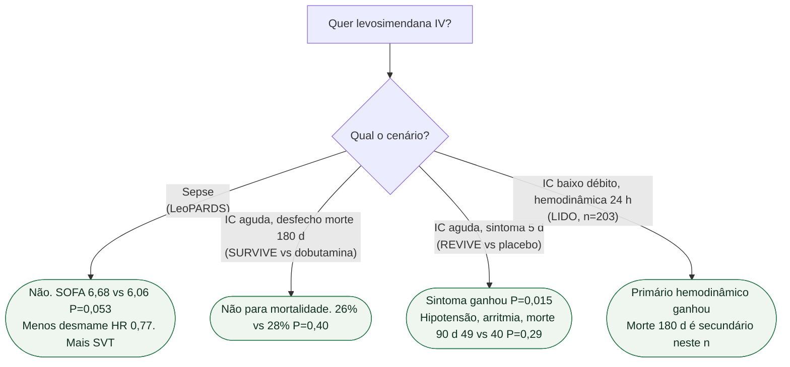

# Fluxograma: levosimendana

```mermaid
flowchart TD
  R0["Quer levosimendana IV?"] --> D1{"Qual o cenário?"}

  D1 -->|"Sepse<br/>(LeoPARDS)"| C1(["Não. SOFA 6,68 vs 6,06 P=0,053<br/>Menos desmame HR 0,77. Mais SVT"])

  D1 -->|"IC aguda, desfecho morte 180 d<br/>(SURVIVE vs dobutamina)"| C2(["Não para mortalidade. 26% vs 28% P=0,40"])

  D1 -->|"IC aguda, sintoma 5 d<br/>(REVIVE vs placebo)"| C3(["Sintoma ganhou P=0,015<br/>Hipotensão, arritmia, morte 90 d 49 vs 40 P=0,29"])

  D1 -->|"IC baixo débito, hemodinâmica 24 h<br/>(LIDO, n=203)"| C4(["Primário hemodinâmico ganhou<br/>Morte 180 d é secundário neste n"])

  classDef conduta fill:#eef6ef,stroke:#2f7a4f,color:#12301f;
  class C1,C2,C3,C4 conduta;
```

## Mensagem prática

**Sepse: não. Morte na IC: SURVIVE empatou. Sintoma: REVIVE paga arritmia.** LIDO não é ensaio de mortalidade.
