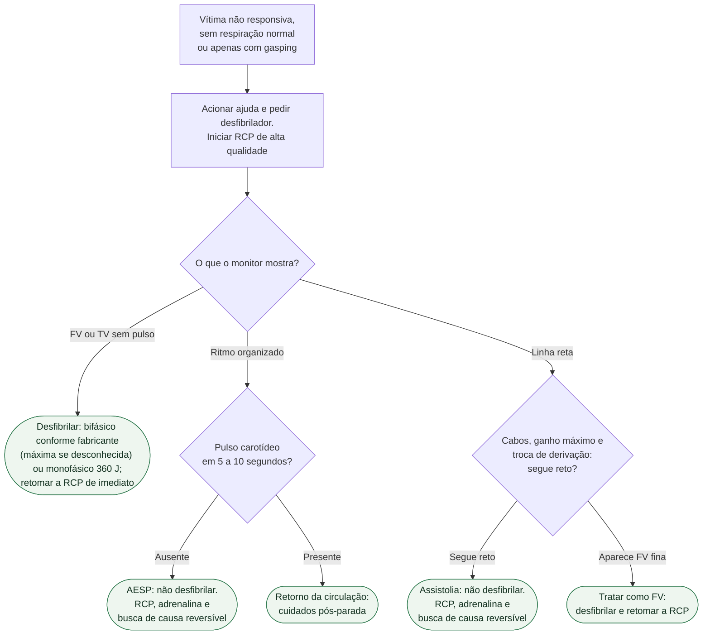

# Fluxograma: Parada cardiorrespiratória — o que o primeiro ritmo decide

A parada é atendida em **ciclos de 2 minutos**, e ciclo não cabe numa árvore de
decisão. O diagrama abaixo cobre o que a árvore representa bem: **a primeira
bifurcação**, aquela em que o ritmo no monitor separa condutas que não se
misturam. O que se repete a cada ciclo está em prosa logo depois — é onde essa
informação fica correta.

## Árvore de decisão: ritmo inicial

## O que se repete a cada ciclo, e por isso não está no diagrama

**Energia da desfibrilação**: no bifásico, usar no primeiro choque a energia
recomendada pelo fabricante (por exemplo, 120–200 J conforme o equipamento); se
ela for desconhecida, usar a energia máxima disponível. Choques bifásicos
subsequentes podem usar energia equivalente ou maior, considerando a máxima. No
monofásico, usar 360 J.

**Parâmetros da compressão**: 100 a 120 por minuto, profundidade de 5 a 6 cm,
ciclos de 30 compressões para 2 ventilações.

**Reavaliação a cada 2 minutos.** O ritmo é checado ao fim de cada ciclo, e quem
comprime é revezado no mesmo intervalo — é quando a qualidade da compressão cai
por fadiga, mesmo sem o socorrista perceber.

**Adrenalina a cada 3 a 5 minutos**, 1 mg por via intravenosa ou intraóssea, em
qualquer ritmo. Nos ritmos não chocáveis, o mais cedo possível; na FV/TVSP, a
partir do segundo ciclo.

**Antiarrítmico na FV/TVSP que persiste**: no algoritmo chocável AHA 2025,
amiodarona ou lidocaína entram durante a RCP **após o terceiro choque**.
Amiodarona: 300 mg, com dose adicional de 150 mg se necessário. Lidocaína:
1,0 a 1,5 mg/kg, com segunda dose de 0,5 a 0,75 mg/kg se persistir.

**Procurar a causa reversível o tempo todo**, em todos os ritmos — os 5H e 5T.
Não é um passo do algoritmo que acontece uma vez: é uma busca paralela que corre
junto com as compressões.

**Depois da via aérea avançada**, as compressões passam a ser contínuas, sem
pausa para ventilar, com uma ventilação a cada 6 segundos.

## Por que a linha reta tem um ramo próprio

Porque ela **não é um diagnóstico**, é uma imagem compatível com dois quadros de
condutas opostas: assistolia e fibrilação ventricular fina. A amplitude do
traçado da FV depende das reservas de ATP do miocárdio, e uma FV terminal pode
aparecer quase plana.

Deixar de desfibrilar uma FV é inadmissível; desfibrilar uma assistolia piora o
prognóstico. É por isso que a diretriz coloca três manobras entre a imagem e a
decisão — conexão dos cabos, ganho máximo, troca de derivação — e dá menos de 10
segundos para elas.

## Tudo com Tudo

- [Cuidados pós-parada e coronariografia](fluxograma-cuidado-pos-parada-e-coronariografia.md)
- [Hipocalemia grave e parada hipocalêmica](fluxograma-hipocalemia-grave-risco-arritmico.md)
- [Torsades de pointes e QT longo adquirido](../Arritmias/fluxograma-torsades-de-pointes-e-qt-longo-adquirido.md)
- [Hipotermia acidental e parada cardiorrespiratória](fluxograma-hipotermia-acidental-e-parada-cardiorrespiratoria.md)
- [Afogamento e parada cardiorrespiratória](fluxograma-afogamento-manejo-da-parada-cardiorrespiratoria.md)
- [Neuroprognóstico multimodal pós-parada](neuroprognostico-multimodal-pos-parada-cardiorrespiratoria-algoritmo-erc-esicm-2021-e-a-atualizacao-aha-2025.md)
