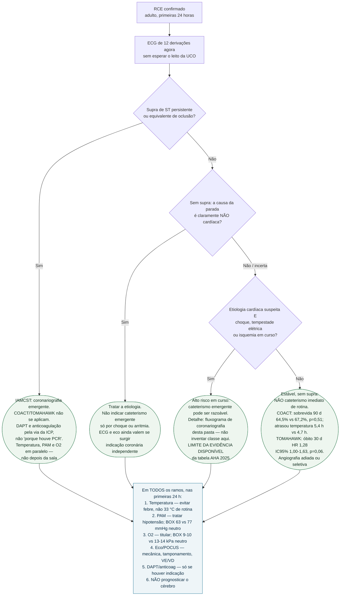
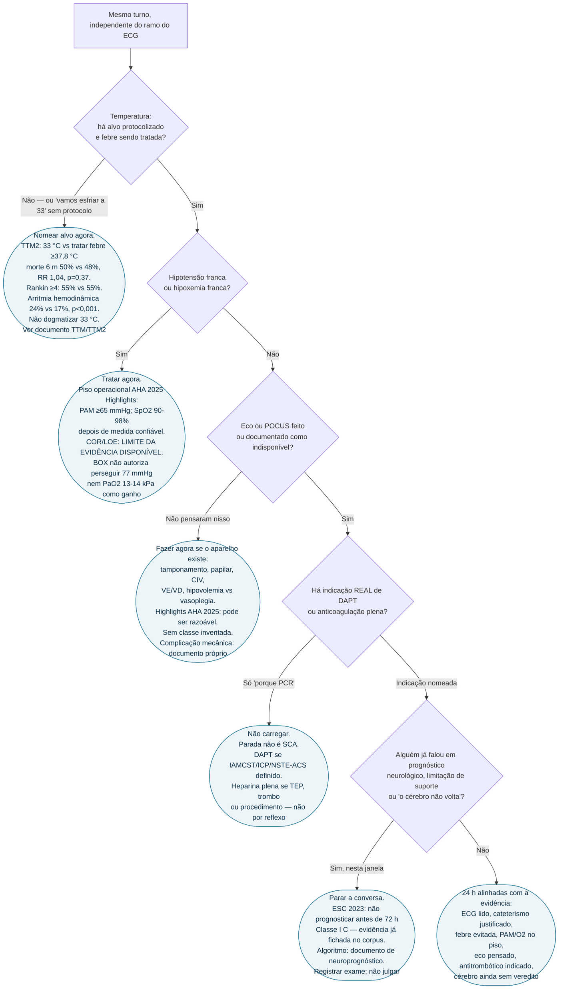

# Fluxograma: pós-ROSC nas primeiras 24 horas — ECG, temperatura, pressão e cateterismo

A pergunta desta árvore não é “o paciente vai acordar?”. É: **nas próximas 24 horas, o cardiologista já decidiu ECG, cateterismo, temperatura, PAM/oxigênio, eco e antitrombótico — e já recusou prognosticar o cérebro?**

O playbook em prosa está em `pos-rosc-primeiras-24-horas-o-que-o-cardiologista-decide.md`. O ramo isolado de coronariografia, com a nuance AHA 2025 de alto risco sem supra, está em `fluxograma-cuidado-pos-parada-e-coronariografia.md` — esta árvore não o substitui.

Temperatura, PAM e oxigênio **não ramificam o cateterismo**: correm em paralelo nos dois lados do ECG. Entraram no diagrama de propósito, porque o erro clássico é tratar o pós-RCE como uma única decisão (ir ou não à hemodinâmica).

## Árvore de decisão

## Subárvore paralela — o que não espera o resultado do cateterismo

## O que as árvores não mostram — de propósito

- **Como** prognosticar (EEG, NSE, SSEP, RM, mioclonia). Isso começa depois das 24 horas e mora no algoritmo ERC-ESICM / AHA 2025 desta pasta.
- **Qual** dispositivo de temperatura e **qual** vasopressor. Nenhum ensaio citado aqui comparou método de resfriamento nem noradrenalina versus outro no pós-RCE.
- **Parada intra-hospitalar e criança.** TTM2, COACT, TOMAHAWK e BOX são extra-hospitalares em adultos.
- **Classe da angiografia emergente no sem-supra de alto risco.** O fluxograma canônico de coronariografia desta pasta já discute o ramo; a tabela AHA 2025 não foi aberta nesta revisão editorial.

## Números que a árvore usa — e de onde vêm

Todos extraídos dos abstracts lidos via PubMed E-utilities nesta revisão editorial, não de memória:

| Ensaio | PMID | Comparação | Primário | O que muda a 24 h |
|---|---|---|---|---|
| TTM2 | 34133859 | 33 °C vs tratar febre ≥37,8 °C | Morte 6 m 50% vs 48%, RR 1,04, p=0,37 | Evitar febre; 33 °C soma arritmia (24% vs 17%) |
| COACT | 30883057 | Angio imediata vs adiada, sem IAMCST | Sobrevida 90 d 64,5% vs 67,2%, p=0,51 | Não ir de rotina; imediata atrasou temperatura |
| TOMAHAWK | 34459570 | Angio imediata vs adiada/seletiva, sem supra | Óbito 30 d 54% vs 46%, HR 1,28, p=0,06 | Ausência de benefício; sinal desfavorável não descartado |
| BOX-PAM | 36027564 | PAM 77 vs 63 mmHg | Morte/CPC 3–4 34% vs 32%, p=0,56 | Não perseguir 77 mmHg |
| BOX-O2 | 36027567 | PaO2 9–10 vs 13–14 kPa | 32,0% vs 33,9%, p=0,69 | Não perseguir hiperóxia liberal |

## Tudo com Tudo

- [Protocolo: o que o cardiologista decide nas primeiras 24 h](pos-rosc-primeiras-24-horas-o-que-o-cardiologista-decide.md)
- [Fluxograma: cuidado pós-parada e coronariografia](fluxograma-cuidado-pos-parada-e-coronariografia.md)
- [COACT e TOMAHAWK](coronariografia-imediata-apos-parada-cardiaca-sem-supra-de-st-coact-e-tomahawk.md)
- [TTM e TTM2](controle-de-temperatura-pos-parada-cardiorrespiratoria-ttm-e-ttm2.md)
- [BOX](metas-de-pressao-arterial-e-de-oxigenacao-pos-parada-cardiorrespiratoria-o-ensaio-box.md)
- [Neuroprognóstico](neuroprognostico-multimodal-pos-parada-cardiorrespiratoria-algoritmo-erc-esicm-2021-e-a-atualizacao-aha-2025.md)
