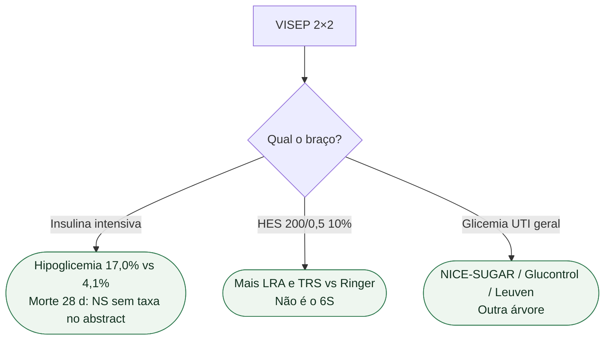

# Fluxograma: VISEP tem dois braços

```mermaid
flowchart TD
  R0["VISEP 2×2"] --> D1{"Qual o braço?"}

  D1 -->|"Insulina intensiva"| C1(["Hipoglicemia 17,0% vs 4,1%<br/>Morte 28 d: NS sem taxa no abstract"])

  D1 -->|"HES 200/0,5 10%"| C2(["Mais LRA e TRS vs Ringer<br/>Não é o 6S"])

  D1 -->|"Glicemia UTI geral"| C3(["NICE-SUGAR / Glucontrol / Leuven<br/>Outra árvore"])

  classDef conduta fill:#eef6ef,stroke:#2f7a4f,color:#12301f;
  class C1,C2,C3 conduta;
```
