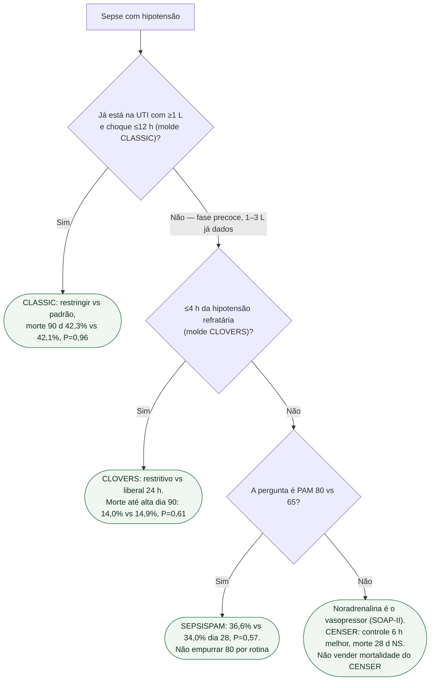

# Fluxograma: volume e vasopressor na sepse

## Mensagem prática

**Nem restringir volume nem puxar PAM a 80 salvou vidas nestes ensaios.** Noradrenalina cedo controla pressão (CENSER); mortalidade é outra conversa.
