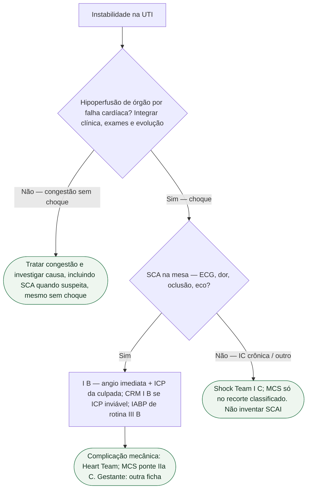

# SCA com choque: o que não misturar com IC descompensada

Duas portas de UTI se confundem: **SCA com choque cardiogênico** e **IC descompensada** (congestão, edema agudo, IC crônica que piora). Misturá-las custa o cateterismo — ou um diurético com a culpada fechada. Esta ficha separa. Não calcula estágio SCAI. Não copia inotrópico da gestante.

Porta obstétrica já escrita: [Choque cardiogênico na gestante — porta UTI, ESC 2025](/biblioteca/choque-cardiogenico-na-gestante-esc-2025) (UTI) e [ESC 2025: insuficiência cardíaca aguda e choque na gestação](/biblioteca/esc-2025-ic-aguda-e-choque-na-gestacao) (Gravidez). **Não se repetem** inotrópico I C, cesárea I C, transferência IIa C nem o 140/90. Na gestação ou puerpério, envolver imediatamente a equipe cardio-obstétrica; isso não suspende estabilização nem reperfusão quando indicadas.

## Duas perguntas, nesta ordem

**1. Há hipoperfusão de órgão por falha de bomba?** A ESC 2026 de IC (PMID **42661420**) define choque cardiogênico como hipoperfusão crítica de órgão por disfunção cardíaca primária. O SHARC, citado na mesma seção, pede evidência clínica **e** bioquímica sustentada. Lactato arterial **>2 mmol/L** é a manifestação bioquímica naquele texto. **Não há corte de pressão isolado.** Hipotensão ajuda; não fecha. Oligúria, pele fria, confusão, lesão hepática/renal aguda: quadro clínico, não escore inventado.

A ESC 2026 troca “IC aguda” por **IC descompensada (DHF)** e descreve **quatro categorias** que se sobrepõem: IC esquerda descompensada, IC direita descompensada, edema agudo de pulmão e choque. As três primeiras podem viver de congestão. A quarta pede Shock Team, vasoativo e suporte mecânico — não “mais furosemida de manhã”.

**2. A causa é SCA — ou IC crônica que descompensou?** A ESC 2023 de SCA (Byrne, PMID **37622654**): IC aguda *de novo* complicando SCA **deve ser distinguida** de IC prévia exacerbada por SCA. Troponina na IC descompensada **pode ser lesão da própria IC**, não necrose de oclusão. Eco de emergência cabe nas duas portas; **angiografia imediata** cabe quando a SCA com choque (ou IC aguda presumida por isquemia em curso) está na mesa.

## O que a SCA com choque manda — e o que a IC descompensada não herda

ESC 2023:

- Angio **imediata** e ICP da culpada no choque complicando SCA — **I B**.
- CRM de emergência se a ICP da culpada falhar ou for inviável — **I B**.
- NSTE-ACS com instabilidade ou choque: estratégia **invasiva imediata** (altíssimo risco), com dor refratária, arritmia ameaçadora, complicação mecânica e IC aguda por isquemia em curso — **I**.
- IABP **de rotina** no choque da SCA **sem** complicação mecânica — **III B**.
- No índice, ICP só da **culpada** (CULPRIT-SHOCK, citado pela ESC 2023). Essa estratégia evita ICP rotineira de lesões não culpadas no procedimento inicial; a necessidade de revascularização posterior é reavaliada após estabilização.

ESC 2026 de IC — **não** colar na SCA como a mesma frase:

- Shock Team em candidatos a MCS temporário — **I C**.
- Bomba de fluxo microaxial **deve ser considerada** em **selecionados** com choque por IAMCSST, disfunção sistólica de VE e **sem** risco de lesão hipóxica cerebral — **IIa B1**.
- MCS temporário **não recomendado** em choque por IAM **não selecionado** — **III B1**.
- MCS como ponte na complicação mecânica do IAM — **IIa C**.

Não inventar mortalidade por estágio SCAI, PAM-alvo nem µg/kg/min. A ESC 2026 **nomeia** SCAI (A) em risco, (B) pré-choque, (C) clássico, (D) em deterioração, (E) extremis e aponta a Table 13. **Números da tabela não entram.**

## O que não misturar

- Diurético de congestão **não** substitui a sala no choque da SCA.
- Troponina “um pouco alta” na IC descompensada **não** é, sozinha, IAM tipo 1.
- SCAI **nomeado** ≠ mortalidade de memória.
- Impella/ECMO **não** são rotina: IIa no selecionado, III no não selecionado.
- Gestante: outra ficha, **outra** tabela de inotrópico.
- Quádrupla da IC crônica **não** se inicia no choque instável.

## Tudo com Tudo

- **Terapia intensiva.** Hipoperfusão vs congestão; SCA vs IC crônica.
- **Doença coronariana.** PMID **37622654**: I B da angio; III B do IABP de rotina; culpada no índice.
- **Insuficiência cardíaca.** PMID **42661420**: quatro categorias de DHF; Shock Team I C; MCS IIa / III.
- **Gravidez.** [Choque cardiogênico na gestante — porta UTI, ESC 2025](/biblioteca/choque-cardiogenico-na-gestante-esc-2025) — cruzar, não copiar.
- **Dispositivos.** MCS é Shock Team, não marca na admissão.
- **Comunicação clínica.** “Infarto com choque, vai à sala” versus “IC que inchou — outro relógio”.
- **Reabilitação cardíaca.** Sobreviver não cancela o encaminhamento da SCA.

## Limite editorial

PMID **37622654** e **42661420**. SCAI: **nomes**, sem números inventados. Gestante: só o cruzamento. Doses: omitidas.
Lactato é um marcador de perfusão e prognóstico, não um requisito para aguardar deterioração: um valor inicialmente normal não deve encerrar a investigação quando os sinais clínicos sugerem choque. SCA e IC descompensada podem coexistir, incluindo exacerbação de IC prévia pela isquemia.
