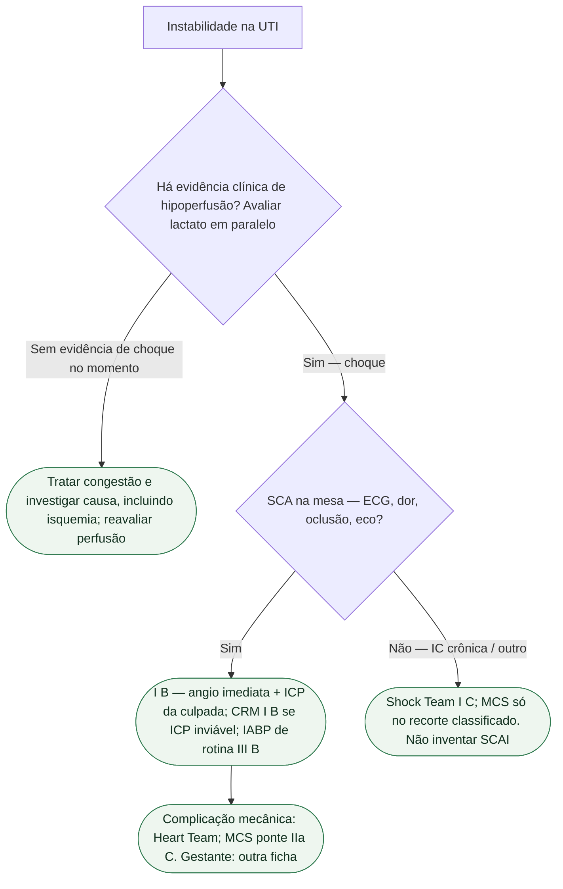

# SCA com choque: o que não misturar com IC descompensada

Duas portas de UTI se confundem: **SCA com choque cardiogênico** e **IC descompensada** (congestão, edema agudo, IC crônica que piora). Misturá-las custa o cateterismo — ou um diurético com a culpada fechada. Esta ficha separa. Não calcula estágio SCAI. Não copia inotrópico da gestante.

Porta obstétrica já escrita: `choque-cardiogenico-na-gestante-esc-2025.md` (UTI) e `esc-2025-ic-aguda-e-choque-na-gestacao.md` (Gravidez). **Não se repetem** inotrópico I C, cesárea I C, transferência IIa C nem o 140/90. Em gestantes e puérperas, associar a avaliação obstétrica e o Pregnancy Heart Team à investigação e ao tratamento imediato.

## Duas perguntas, nesta ordem

**1. Há hipoperfusão de órgão por falha de bomba?** A ESC 2026 de IC (PMID **42661420**) define choque cardiogênico como hipoperfusão crítica de órgão por disfunção cardíaca primária. A avaliação integra os sinais clínicos e exames como lactato, função renal e hepática; a estabilização não deve aguardar o resultado do lactato. **Não há corte de pressão isolado.** Hipotensão ajuda; não fecha. Oligúria, pele fria, confusão, lesão hepática/renal aguda: quadro clínico, não escore inventado.

A ESC 2026 troca “IC aguda” por **IC descompensada (DHF)** e descreve **quatro categorias** que se sobrepõem: IC esquerda descompensada, IC direita descompensada, edema agudo de pulmão e choque. As três primeiras podem viver de congestão. A quarta pede Shock Team, vasoativo e suporte mecânico — não “mais furosemida de manhã”.

**2. A causa é SCA — ou IC crônica que descompensou?** A ESC 2023 de SCA (Byrne, PMID **37622654**): IC aguda *de novo* complicando SCA **deve ser distinguida** de IC prévia exacerbada por SCA. Troponina na IC descompensada **pode ser lesão da própria IC**, não necrose de oclusão. Eco de emergência cabe nas duas portas; **angiografia imediata** cabe quando a SCA com choque (ou IC aguda presumida por isquemia em curso) está na mesa.

## O que a SCA com choque manda — e o que a IC descompensada não herda

ESC 2023:

- Angio **imediata** e ICP da culpada no choque complicando SCA — **I B**.
- CRM de emergência se a ICP da culpada falhar ou for inviável — **I B**.
- NSTE-ACS com instabilidade ou choque: estratégia **invasiva imediata** (altíssimo risco), com dor refratária, arritmia ameaçadora, complicação mecânica e IC aguda por isquemia em curso — **I**.
- IABP **de rotina** no choque da SCA **sem** complicação mecânica — **III B**.
- No índice, ICP só da **culpada** (CULPRIT-SHOCK, citado pela ESC 2023). A abordagem das outras lesões é planejada após a fase aguda, de acordo com anatomia e evolução.

ESC 2026 de IC — **não** colar na SCA como a mesma frase:

- Shock Team em candidatos a MCS temporário — **I C**.
- Bomba de fluxo microaxial **deve ser considerada** em **selecionados** com choque por IAMCSST, disfunção sistólica de VE e **sem** risco de lesão hipóxica cerebral — **IIa B1**.
- MCS temporário **não recomendado** em choque por IAM **não selecionado** — **III B1**.
- MCS como ponte na complicação mecânica do IAM — **IIa C**.

Não inventar mortalidade por estágio SCAI, PAM-alvo nem µg/kg/min. A ESC 2026 **nomeia** SCAI (A) em risco, (B) pré-choque, (C) clássico, (D) em deterioração, (E) extremis e aponta a Table 13. **Números da tabela não entram.**

## O que não misturar

- Diurético de congestão **não** substitui a sala no choque da SCA.
- Troponina “um pouco alta” na IC descompensada **não** é, sozinha, IAM tipo 1.
- SCAI **nomeado** ≠ mortalidade de memória.
- Impella/ECMO **não** são rotina: IIa no selecionado, III no não selecionado.
- Gestante: outra ficha, **outra** tabela de inotrópico.
- Quádrupla da IC crônica **não** se inicia no choque instável.

## Tudo com Tudo

- [Choque cardiogênico na gestante — porta UTI, ESC 2025](/biblioteca/choque-cardiogenico-na-gestante-esc-2025)
- [Choque cardiogênico e MINS: diagnósticos diferentes que podem coexistir](/biblioteca/choque-cardiogenico-nao-e-mins)
- [Choque cardiogênico fora da gestante — o que a ESC 2026 de IC muda na porta UTI](/biblioteca/choque-cardiogenico-o-que-a-esc-2026-de-ic-muda-fora-da-gestante)
- [DanGer Shock: bomba microaxial no IAMCSST com choque](/biblioteca/danger-shock-bomba-microaxial-no-iamcsst-com-choque)
