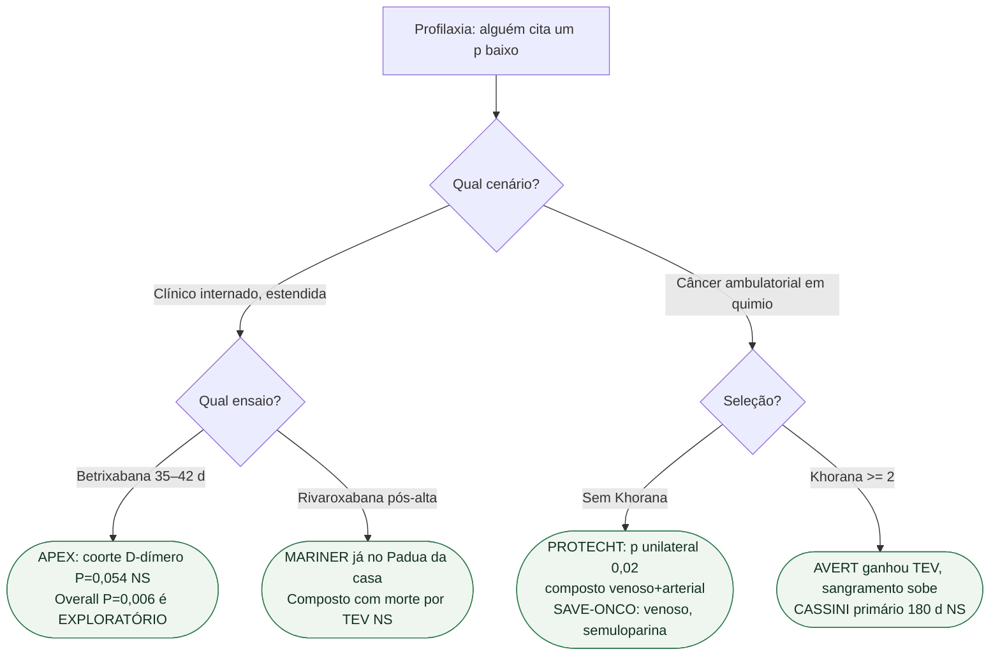

# Fluxograma: sequencial, unilateral, suporte — nenhum substitui o primário

## Mensagem prática

**P exploratório, p unilateral e análise de suporte não viram primário.** APEX não autoriza betrixabana estendida. PROTECHT não autoriza HBPM genérica nem TEV isolado. CASSINI não autoriza rivaroxabana 10 mg em 180 dias.
