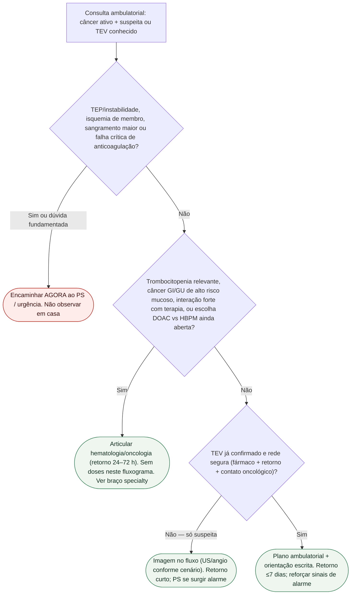

# Fluxograma: destino ambulatorial no TEV associado ao câncer

Prosa: [`sinalizadores-ambulatoriais-tev-associado-ao-cancer-destino-ps-vs-oncologia`](sinalizadores-ambulatoriais-tev-associado-ao-cancer-destino-ps-vs-oncologia.md) · [`tev-associado-ao-cancer-quando-escalar-hematologia-oncologia-vs-urgencia`](tev-associado-ao-cancer-quando-escalar-hematologia-oncologia-vs-urgencia.md).

Além de [#837](https://github.com/rafaelpaesmeirelles/MeuCardio/pull/837) (pós-TEP) e [#871](https://github.com/rafaelpaesmeirelles/MeuCardio/pull/871) (TVP genérica). Escolha DOAC vs HBPM: [`fluxograma-doac-versus-dalteparina-no-tev-do-cancer`](fluxograma-doac-versus-dalteparina-no-tev-do-cancer.md).

## Árvore de decisão

## Notas

- **D1** = gate de segurança (além de #837/#871, com pivô câncer).
- **D2** = gatilho specialty — não substitui a monografia de escolha do anticoagulante.
- **D3** = rede segura obrigatória antes de liberar CAT confirmado.
- **Não decide** doses, limiar plaquetário numérico nem duração após 3–6 meses.
