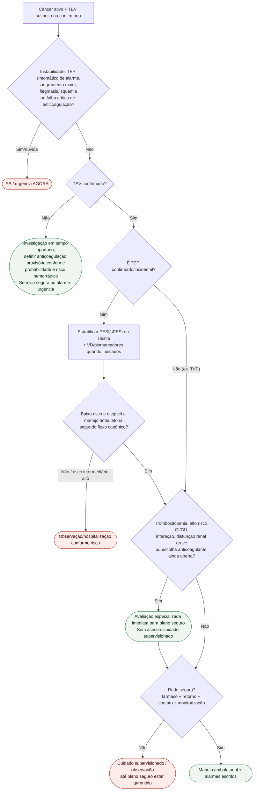

# Fluxograma: destino ambulatorial no TEV associado ao câncer

## Notas
- TEP e TVP não compartilham automaticamente o mesmo gate de alta.
- Disfunção renal grave precisa de revisão especializada porque altera seleção/segurança de anticoagulantes.
- TEV confirmado sem rede segura não volta ao ramo de “pedir imagem”.
- Sem doses neste fluxo.

No câncer, sPESI já é ≥1 pelo diagnóstico oncológico; isso exige avaliação integrada, não proíbe por si só toda via ambulatorial. Critérios Hestia e avaliação clínica/VD, quando apropriados, podem apoiar seleção de baixo risco. Não misturar categorias AHA/ACC 2026 com estratos ESC como equivalentes automáticos. Suspeita de TEV demanda investigação em tempo oportuno e decisão sobre anticoagulação enquanto se investiga conforme probabilidade/risco hemorrágico; não aguardar consulta eletiva se não houver via diagnóstica segura. TEV confirmado com fatores complexos exige plano imediato, sem deixar o paciente sem tratamento seguro enquanto aguarda especialista.

## Conteúdo CorVIA conectado

- [Sinalizadores no TEV associado ao câncer: PS versus oncologia/hematologia](/biblioteca/sinalizadores-ambulatoriais-tev-associado-ao-cancer-destino-ps-vs-oncologia)
- [TEV associado ao câncer: quando escalar hematologia/oncologia versus urgência](/biblioteca/tev-associado-ao-cancer-quando-escalar-hematologia-oncologia-vs-urgencia)
