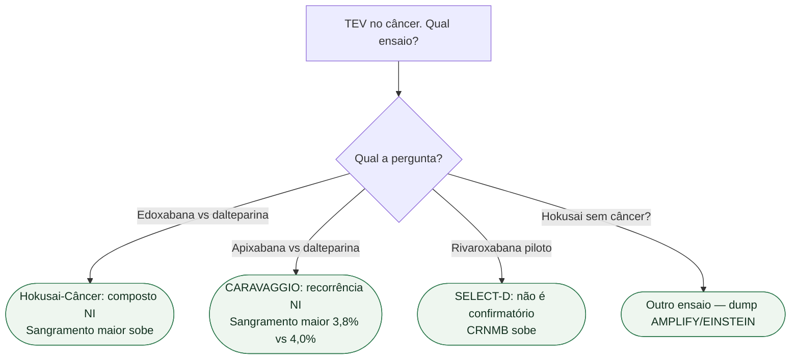

# Fluxograma: DOAC no TEV do câncer

```mermaid
flowchart TD
  R0["TEV no câncer. Qual ensaio?"] --> D1{"Qual a pergunta?"}

  D1 -->|"Edoxabana vs dalteparina"| C1(["Hokusai-Câncer: composto NI<br/>Sangramento maior sobe"])

  D1 -->|"Apixabana vs dalteparina"| C2(["CARAVAGGIO: recorrência NI<br/>Sangramento maior 3,8% vs 4,0%"])

  D1 -->|"Rivaroxabana piloto"| C3(["SELECT-D: não é confirmatório<br/>CRNMB sobe"])

  D1 -->|"Hokusai sem câncer?"| C4(["Outro ensaio — dump AMPLIFY/EINSTEIN"])

  classDef conduta fill:#eef6ef,stroke:#2f7a4f,color:#12301f;
  class C1,C2,C3,C4 conduta;
```

## Mensagem prática

**NI não é superioridade.** Hokusai-Câncer e Hokusai-VTE não são o mesmo paper.
