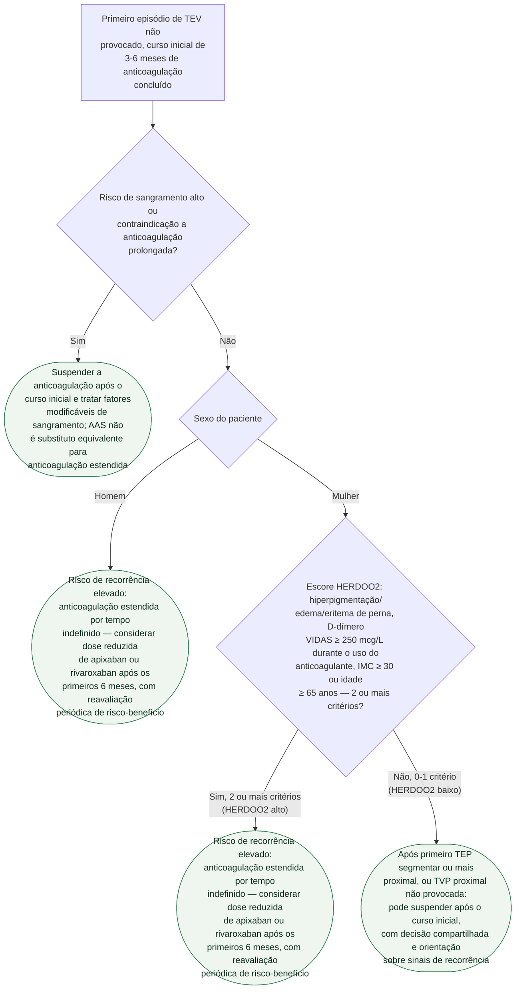

# Fluxograma: Duração da anticoagulação após TEV não provocado

O primeiro episódio de tromboembolismo venoso sem fator de risco identificável
carrega risco de recorrência alto o bastante para que a diretriz ESC 2019
trate a decisão de suspender a anticoagulação no fim do curso inicial (3 a 6
meses) como uma escolha ativa, não um desfecho automático. A árvore abaixo
segue a sequência que pesa mais nessa decisão: risco de sangramento primeiro,
depois sexo do paciente e, em mulheres, o escore HERDOO2 — que foi validado
especificamente para identificar quem pode suspender com segurança.

## Árvore de decisão

## O que a árvore não mostra

**O HERDOO2 foi derivado e validado só em mulheres.** O estudo de validação
multinacional (BMJ 2017) incluiu 2.785 participantes, dos quais 1.213 eram
mulheres; entre as 591 mulheres de baixo risco que efetivamente suspenderam a
anticoagulação, a recorrência foi 3,0% por paciente-ano. A regra foi validada
para primeiro TEP segmentar ou mais proximal ou TVP proximal não provocada —
não para TVP distal isolada — e não tem validação equivalente para homens.
O D-dímero foi medido durante anticoagulação com o ensaio VIDAS; não se deve
substituir automaticamente por outro ensaio, ponto de corte ou coleta depois
da suspensão.

**AMPLIFY-EXT e EINSTEIN CHOICE testaram dose reduzida especificamente para
extensão, não para o tratamento agudo.** No AMPLIFY-EXT, apixaban 2,5 mg
2x/dia reduziu recorrência sintomática de TEV para 1,7% (versus 8,8% com
placebo) sem aumento de sangramento maior; no EINSTEIN CHOICE, rivaroxaban 10
mg/dia e 20 mg/dia foram superiores ao AAS. O ensaio não teve poder para
comparar diretamente as duas doses de rivaroxabana nem demonstrou que 10 mg
produza menos sangramento que 20 mg — a escolha da dose exige o contexto
clínico e a indicação aprovada.

**Reavaliação periódica não é ramo único porque se repete ao longo do
seguimento.** Risco de sangramento, adesão e preferência do paciente mudam com
o tempo — a diretriz recomenda reconsiderar a decisão de continuar em cada
consulta de seguimento, não só no momento em que o curso inicial termina.

**Trombofilia hereditária, câncer ativo e cenários com estudo próprio** (trombo
de ventrículo esquerdo, TEV do câncer, síndrome antifosfolípide) têm algoritmo
de duração distinto do TEV não provocado sem esses fatores, e não estão
representados aqui — a árvore assume que "não provocado" já significa a
ausência desses fatores identificados na investigação inicial.
