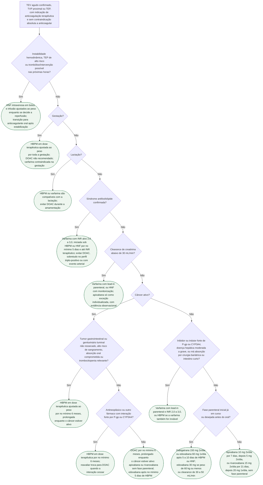

# Fluxograma: Escolha do anticoagulante no TEV — DOAC, varfarina ou HBPM

Nos quatro ensaios pivotais que compararam anticoagulante oral direto (DOAC) com varfarina no
TEV agudo, o resultado se repetiu: eficácia igual, sangramento igual ou menor. Por isso ASH 2020,
ESC 2019 e a diretriz brasileira SBPT 2025 fazem do DOAC a primeira escolha. O erro clínico
frequente não está nesse padrão, e sim nas exceções — que são poucas, bem definidas e apontam
para fármacos diferentes: a síndrome antifosfolípide e o clearance de creatinina muito baixo
levam à varfarina; a gestação e o câncer com mucosa luminal exposta levam à heparina de baixo
peso molecular (HBPM); a instabilidade que pode exigir trombólise leva à heparina não fracionada
(HNF). A árvore abaixo percorre essas exceções na ordem em que se decidem à beira do leito,
antes de chegar ao padrão. Duração do tratamento e escolha entre estender ou suspender ficam em
outro fluxograma desta pasta (ver fluxograma-duracao-da-anticoagulacao-apos-tev-nao-provocado).

## Árvore de decisão

## Por que a instabilidade vem primeiro

A ASH 2020 faz da trombólise seguida de anticoagulação a conduta recomendada no TEP com
comprometimento hemodinâmico (recomendação 6, forte apesar de certeza baixa), definido como
pressão sistólica abaixo de 90 mmHg ou queda de 40 mmHg ou mais em relação à basal. A SBPT 2025
sugere trombólise sistêmica no TEP de alto risco com choque obstrutivo. Nesse cenário, o
anticoagulante inicial é a HNF, porque tem meia-vida curta e é reversível, facilitando a
reperfusão — a estratificação de risco e a decisão de trombolisar estão em
fluxograma-tep-agudo-estratificacao-de-risco-e-decisao-de-trombolise. Para o TEP estável, a AHA/ACC 2026
recomenda HBPM em preferência à HNF quando há fase parenteral (ver
aha-acc-2026-tep-agudo-categorias-clinicas-anticoagulacao-e-terapias-avancadas); a ASH 2020 não
tem recomendação sobre HBPM versus HNF e trata as duas como equivalentes no lead-in.

## Gestação, síndrome antifosfolípide e rim: as três exceções que levam para fora do DOAC

A SBPT 2025 escreve de forma direta que o DOAC deve ser evitado na síndrome antifosfolípide
(SAF), em que a varfarina permanece a opção padrão, e na gestação e lactação. Na gestação, a
HBPM é preferida e a varfarina é contraindicada; na lactação, HBPM e varfarina são compatíveis.
A ESC 2019 dá classe III ao DOAC na gestação. A
ASH 2020 vai na mesma direção com linguagem mais cautelosa: a preferência por DOAC "pode não se
aplicar" a clearance de creatinina abaixo de 30 mL/min, doença hepática moderada a grave e SAF.

Na SAF, a evidência mais forte é o ensaio TRAPS, interrompido após 120 pacientes por excesso de
eventos tromboembólicos com rivaroxabana (12% contra nenhum com varfarina) em pacientes
triplo-positivos — ver trombofilia-hereditaria-e-adquirida-risco-de-recorrencia-e-doac-na-sindrome-antifosfolipide.
O ensaio testou o perfil triplo-positivo; para SAF com um ou dois anticorpos as diretrizes lidas
aqui ainda apontam para a varfarina, e qualquer uso de DOAC nesse subgrupo é decisão
individualizada, sem ensaio que a sustente.

No rim, o corte de 30 mL/min vem dos próprios ensaios: a ASH registra que os estudos
excluíram clearance abaixo de 25 mL/min (apixabana) ou 30 mL/min (demais DOAC), e a SBPT 2025
manda evitar DOAC com clearance de 30 mL/min ou menos, "com exceção da apixabana". Essa
exceção repousa em estudos observacionais reunidos em
tev-com-insuficiencia-renal-grave-e-dialise-doac-fora-dos-ensaios-pivotais — é ela que a
conduta C4 chama de individualizada.

## Câncer ativo: DOAC como padrão, HBPM onde a mucosa ou a interação mandam

A ITAC 2022 aceita DOAC para tratamento inicial e de manutenção no TEV do câncer em quem não
tem alto risco de sangramento gastrointestinal ou geniturinário, sem interação relevante e com
absorção preservada; a ESC 2019 sugere edoxabana ou rivaroxabana como alternativa à HBPM, com
cautela no câncer gastrointestinal; a SBPT 2025 sugere DOAC (condicional, baixa certeza) sem o
recorte de sítio tumoral. O recorte vem do Hokusai VTE Cancer, em que a edoxabana reduziu
recorrência mas aumentou sangramento maior (6,9% contra 4,0%), concentrado em tumores
gastrointestinais, enquanto o CARAVAGGIO não mostrou excesso de sangramento com apixabana
(3,8% contra 4,0%) — detalhes em
trombose-associada-ao-cancer-escore-de-khorana-e-escolha-de-anticoagulante. No Hokusai VTE
Cancer a edoxabana foi precedida de HBPM por no mínimo 5 dias, e a apixabana do CARAVAGGIO
foi dada sem fase parenteral — a conduta C7 reproduz esses regimes. A duração mínima é
de 6 meses. A conduta com plaquetas abaixo de 50.000/µL, que muda dose e fármaco, está em
fluxograma-tromboembolismo-pulmonar-agudo-associado-ao-cancer-e-trombocitopenia, e não é
repetida aqui.

| Ensaio | Comparação | TEV recorrente | Sangramento maior |
|---|---|---|---|
| CARAVAGGIO (2020) | apixabana vs dalteparina, 6 meses, 1.155 pacientes | 5,6% vs 7,9% | 3,8% vs 4,0% |
| Hokusai VTE Cancer (2018) | edoxabana vs dalteparina, 12 meses, 1.046 pacientes | 7,9% vs 11,3% | 6,9% vs 4,0% |

## O padrão: qual DOAC, com ou sem heparina antes

A ASH 2020 não sugere um DOAC sobre outro (recomendação 4, certeza muito baixa) e lista o que
deve guiar a escolha: necessidade de lead-in parenteral, posologia uma ou duas vezes ao dia,
custo, função renal, fármacos concomitantes metabolizados por CYP3A4 ou P-glicoproteína e
presença de câncer. A mesma diretriz acrescenta que SAF, cirurgia bariátrica, intestino curto e
extremos de peso tornam o paciente candidato não ideal a DOAC — daí o ramo D8 (ver
doac-pos-cirurgia-bariatrica-de-bypass-gastrico-farmacocinetica-alterada e
doac-em-obesidade-extrema-a-mudanca-de-orientacao-da-isth para os dois últimos cenários).

O ramo D9 traduz a diferença de desenho dos ensaios pivotais: apixabana e rivaroxabana foram
testadas sem heparina prévia, com dose de ataque; dabigatrana e edoxabana foram testadas após
fase parenteral, que a ASH descreve como "até 5 a 10 dias" de HNF ou HBPM. Iniciar dabigatrana
ou edoxabana sem essa fase é usar esquema que nenhum ensaio testou.

| Fármaco | Fase parenteral | Regime testado no ensaio pivotal |
|---|---|---|
| Apixabana (AMPLIFY) | Não | 10 mg 2x/dia por 7 dias, depois 5 mg 2x/dia |
| Rivaroxabana (EINSTEIN-PE) | Não | 15 mg 2x/dia por 3 semanas, depois 20 mg 1x/dia |
| Dabigatrana (RE-COVER) | Sim, mediana de 9 dias | 150 mg 2x/dia |
| Edoxabana (HOKUSAI-VTE) | Sim | 60 mg 1x/dia; 30 mg se clearance 30 a 50 mL/min ou peso de 60 kg ou menos |
| Varfarina | Sim, no mínimo 5 dias e INR terapêutico por 24 h | INR 2,0 a 3,0 |

A dose de HBPM nas condutas C2, C5 e C6 é a terapêutica ajustada ao peso conforme a bula
vigente do produto e a função renal. A dalteparina do CARAVAGGIO foi 200 UI/kg 1x/dia no primeiro mês e 150 UI/kg
1x/dia depois.

## Limitações

- A árvore usa 30 mL/min como limite operacional conservador, alinhado à ASH 2020 e à SBPT 2025; a rotulagem varia por fármaco e deve ser consultada antes da prescrição.
- A exceção da apixabana com clearance abaixo de 30 mL/min é observacional; não há ensaio
  randomizado dedicado.
- O ramo de interação medicamentosa (D7 e D8) é qualitativo; a lista de inibidores e indutores
  fortes de P-gp e CYP3A4 deve ser conferida na bula de cada DOAC antes de prescrever.
- Este fluxograma não decide duração nem dose reduzida na extensão; não cobre prótese valvar
  mecânica, trombo de ventrículo esquerdo nem trombose venosa cerebral, que têm documentos
  próprios no acervo.

## Tudo com Tudo

- [DOAC no Tratamento do TEV Agudo: AMPLIFY, EINSTEIN-PE, RE-COVER e HOKUSAI-VTE](/biblioteca/doac-no-tratamento-do-tev-agudo-amplify-einstein-pe-re-cover-e-hokusai-vte)
- [Trombofilia Hereditária e Adquirida: Risco de Recorrência e DOAC na Síndrome Antifosfolípide](/biblioteca/trombofilia-hereditaria-e-adquirida-risco-de-recorrencia-e-doac-na-sindrome-antifosfolipide)
- [TEV com Insuficiência Renal Grave e Diálise: DOAC Fora dos Ensaios Pivotais](/biblioteca/tev-com-insuficiencia-renal-grave-e-dialise-doac-fora-dos-ensaios-pivotais)
- [Trombose associada ao câncer: escore de Khorana e escolha de anticoagulante](/biblioteca/trombose-associada-ao-cancer-escore-de-khorana-e-escolha-de-anticoagulante)
- [Fluxograma: TEP agudo — estratificação de risco e decisão de trombólise](/biblioteca/fluxograma-tep-agudo-estratificacao-de-risco-e-decisao-de-trombolise)
- [Fluxograma: TEP agudo na gestação e no puerpério (ESC 2025)](/biblioteca/fluxograma-tromboembolismo-pulmonar-agudo-na-gestacao-e-puerperio-esc-2025)
- [Fluxograma: Duração da anticoagulação após primeiro episódio de TEV não provocado](/biblioteca/fluxograma-duracao-da-anticoagulacao-apos-tev-nao-provocado)
