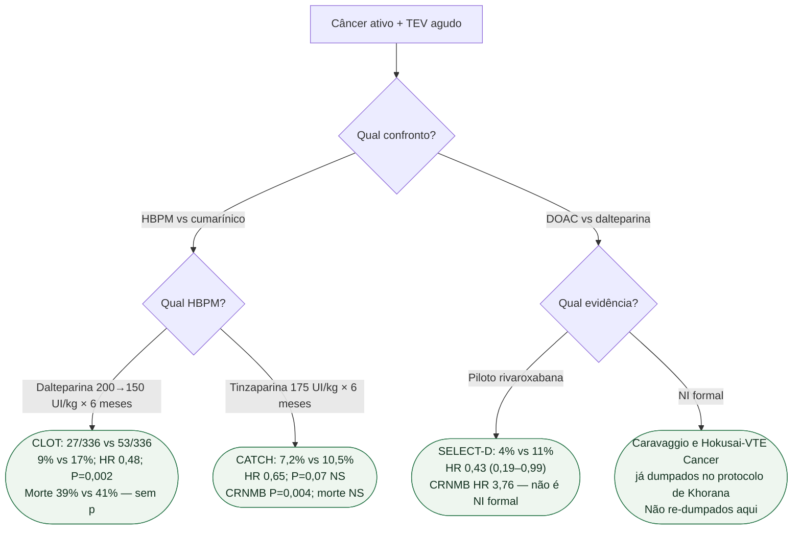

# Fluxograma: CLOT não é CATCH; SELECT-D não é Caravaggio

## Mensagem prática

**CLOT justifica dalteparina vs cumarínico. CATCH não replica isso com tinzaparina.** SELECT-D é piloto: menos recorrência pontual, mais CRNMB — não atropelar Caravaggio/Hokusai nem a ressalva GI/GU.
