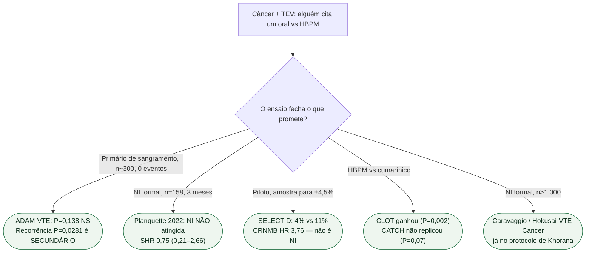

# Fluxograma: ensaio pequeno não atropela NI formal

## Mensagem prática

**Não promover secundário de ensaio pequeno, nem NI que o n não fechou.** Caravaggio e Hokusai continuam sendo o confronto oral vs dalteparina com tamanho. CLOT não autoriza toda HBPM — CATCH é o recado.
