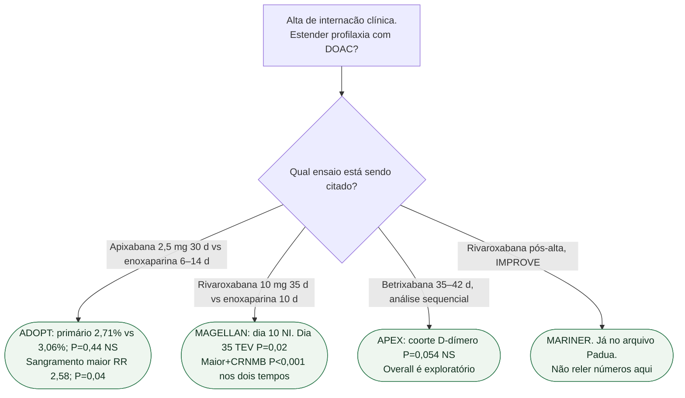

# Fluxograma: estender anticoagulante no clínico?

## Mensagem prática

**Nenhum destes autoriza estender DOAC de rotina na alta do clínico.** ADOPT empata e sangra; MAGELLAN reduz TEV no dia 35 com mais sangramento; APEX falha o primário sequencial.
