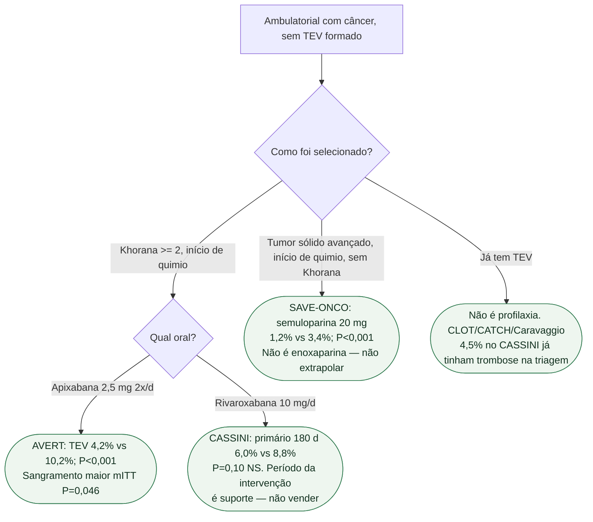

# Fluxograma: profilaxia primária ambulatorial — o primário decide

## Mensagem prática

**AVERT ganhou TEV e pagou sangramento maior. CASSINI não ganhou o primário de 180 dias.** Semuloparina não autoriza HBPM de gaveta. ITAC no protocolo da casa é mais estreita (pâncreas avançado) do que o Khorana ≥2 destes ensaios — não fundir as duas frases.
