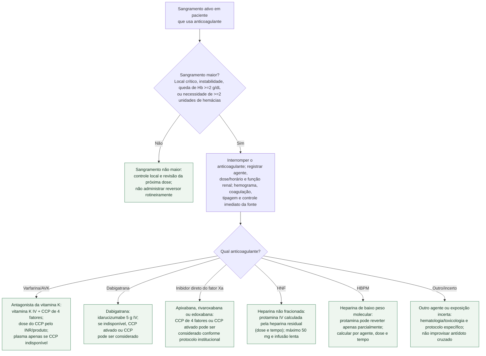

# Sangramento maior em paciente anticoagulado

Antídoto não é resposta para qualquer sangramento. Primeiro classifique a
gravidade; depois identifique fármaco, última dose, função renal e sítio. Em
hemorragia intracraniana ou outro local crítico, a reversão não deve esperar o
resultado de ensaio específico quando há exposição clinicamente relevante.

## Árvore de decisão

## Correções de segurança inseparáveis do fluxo

**Antiagregante não é suspenso automaticamente.** O anticoagulante causador é
interrompido no sangramento maior. Já aspirina ou inibidor P2Y12 exige balanço
entre hemostasia e indicação — sobretudo após intervenção coronária recente —
com a equipe responsável. A versão anterior mandava suspender ambos em bloco.

**Alfa-andexanete não é mais um ramo automático.** No ANNEXA-I, em hemorragia
intracerebral após inibidor do fator Xa, eficácia hemostática ocorreu em 67,0%
com alfa-andexanete e 53,1% com cuidado usual, mas eventos trombóticos ocorreram
em 10,3% versus 5,6% e AVC isquêmico em 6,5% versus 1,5%; não houve diferença
apreciável em função ou morte em 30 dias. Em 22 de dezembro de 2025, a FDA
informou que os riscos superavam os benefícios e encerrou venda/fabricação nos
EUA; a retirada da aprovação consta em 23 de dezembro de 2025.

A Anvisa havia concedido registro ao Ondexxya em 4 de setembro de 2023 para
apixabana/rivaroxabana em sangramento com risco à vida ou não controlado. Como
os marcos regulatórios divergiram, eventual uso fora dos EUA requer conferir a
situação regulatória e disponibilidade locais e decisão multidisciplinar; este
fluxograma não publica dose nem o posiciona à frente do CCP.

**Protamina depende de exposição residual.** A equivalência de 1 mg por 100 UI
vale para heparina ainda circulante e deve cair conforme o tempo desde a dose.
Aplicá-la a toda a heparina das últimas 2-3 horas superestima a necessidade e
aumenta risco de hipotensão/broncoespasmo. Na HBPM, a neutralização é parcial.

**Carvão ativado não ocupa o algoritmo central.** Pode reduzir absorção após
ingestão muito recente de anticoagulante oral, mas a janela varia pelo agente e
a evidência clínica é limitada; risco de aspiração e proteção de via aérea são
decisivos. Discutir com toxicologia, sem atrasar controle da fonte e reversão.

## Retomada da anticoagulação

Reversão aumenta risco trombótico, mas “retomar assim que houver hemostasia”
não é um prazo universal. Sítio e causa do sangramento, controle definitivo da
fonte, indicação trombótica e risco de recorrência definem a decisão. Hemorragia
intracraniana exige algoritmo próprio e não deve herdar o prazo de sangramento
extracraniano.

## Tudo com Tudo

- [Reversão de anticoagulante em sangramento maior](reversao-de-anticoagulante-em-sangramento-maior-idarucizumabe-e-andexanet-alfa.md)
- [Reinício da anticoagulação após hemorragia intracraniana](../Fibrilação_atrial/reiniciar-anticoagulacao-na-fa-apos-hemorragia-intracraniana-sostart-prestige-af-e-a-metanalise-cocroach.md)
- [TEV recorrente sob anticoagulação terapêutica](tev-recorrente-sob-anticoagulacao-em-dose-terapeutica-conduta.md)
- [Interrupção do anticoagulante para procedimento eletivo](../Fibrilação_atrial/interrupcao-do-anticoagulante-para-procedimento-eletivo-na-fa-bridge-e-pause.md)
