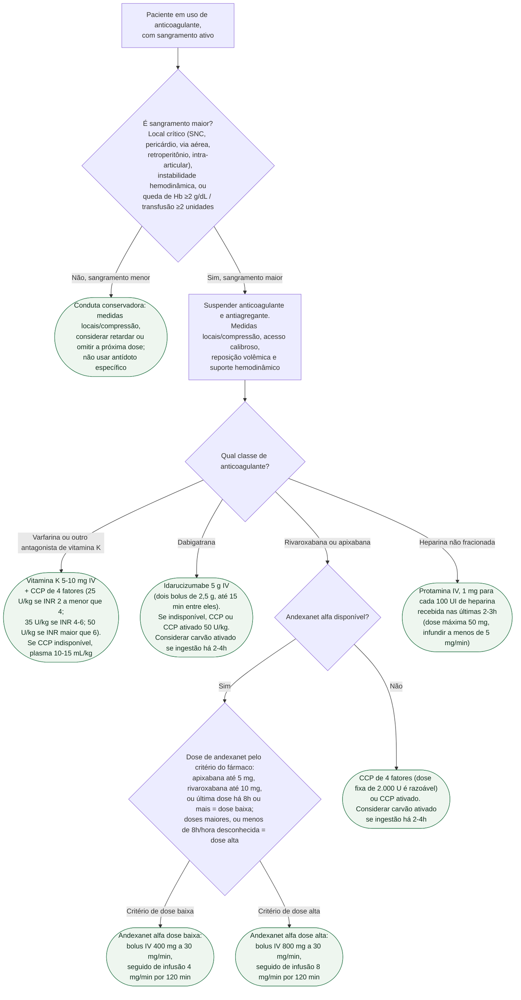

# Sangramento maior em paciente anticoagulado

Nem todo sangramento em paciente anticoagulado pede antídoto: a primeira
decisão é separar sangramento **maior** — risco de vida, local crítico ou
instabilidade hemodinâmica — de sangramento menor, que tem conduta
conservadora. Só depois dessa confirmação a árvore se ramifica pela classe do
anticoagulante, porque o agente de reversão é específico para cada uma.

## Árvore de decisão

## O que se repete em todo ramo, e por isso não está no diagrama

**Suporte hemodinâmico e correção de fatores agravantes.** Cristaloide para
reposição volêmica, correção de hipotermia e acidose — ambas pioram a
coagulopatia —, e investigação de comorbidades que também contribuem para o
sangramento (trombocitopenia, uremia, doença hepática). Transfusão de
concentrado de hemácias segue meta habitual de hemoglobina, mais alta em
doença coronariana estabelecida.

**Envolvimento precoce da especialidade do sítio de sangramento**
(neurocirurgia, endoscopia, radiologia intervencionista) corre em paralelo à
reversão farmacológica, sem esperar o antídoto para acionar.

**Risco trombótico após a reversão.** Os dois antídotos específicos removem
temporariamente a proteção antitrombótica: evento trombótico em 30-90 dias
ocorreu em 6,3-7,4% dos pacientes revertidos com idarucizumabe e em 10% dos
revertidos com andexanet alfa. A anticoagulação deve ser retomada assim que a
hemostasia permitir, não adiada indefinidamente por precaução.

**Andexanet alfa não deve ser considerado sinônimo de sangramento controlado
apenas pela queda laboratorial da atividade anti-fator Xa** — o ANNEXA-4
mostrou que essa redução não prediz de forma confiável a eficácia hemostática
clínica global, ao contrário do idarucizumabe, em que reversão laboratorial e
desfecho clínico caminharam juntos.

**Cada antídoto é específico para sua classe.** Andexanet alfa não reverte
dabigatrana, e idarucizumabe não reverte inibidor do fator Xa — não há
eficácia cruzada entre eles.
