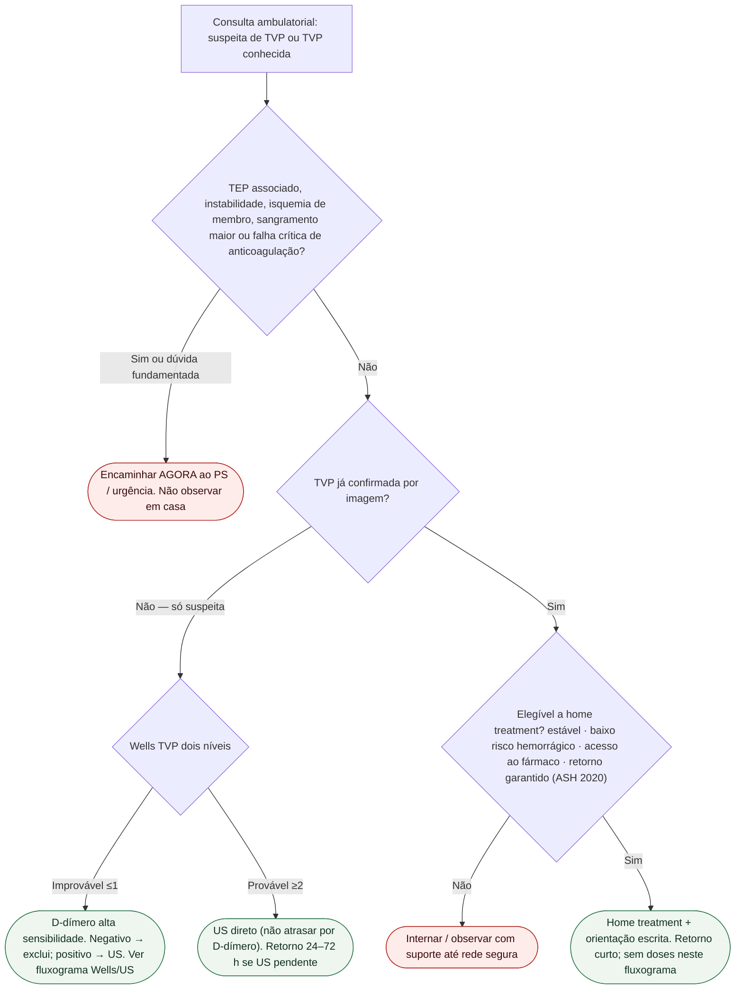

# Fluxograma: sinalizadores ambulatoriais na TVP — destino

Prosa: [`sinalizadores-ambulatoriais-tvp-quando-escalar-urgencia`](sinalizadores-ambulatoriais-tvp-quando-escalar-urgencia.md) · [`tvp-confirmada-no-consultorio-ambulatorial-versus-internacao`](tvp-confirmada-no-consultorio-ambulatorial-versus-internacao.md).

Diagnóstico (Wells/D-dímero/US): [`fluxograma-trombose-venosa-profunda-suspeita-wells-d-dimero-e-ultrassom`](fluxograma-trombose-venosa-profunda-suspeita-wells-d-dimero-e-ultrassom.md). Pós-TEP: [#837](https://github.com/rafaelpaesmeirelles/MeuCardio/pull/837).

## Árvore de decisão

## Notas

- **D1** = gate de segurança (além do pós-TEP do #837).
- **D3** = só aponta o caminho; o detalhe do algoritmo está no fluxograma Wells/US.
- **D4** = elegibilidade ASH 2020 — ver protocolo irmão de TVP confirmada.
- **Não decide** doses, escolha DOAC vs HBPM nem duração após 3–6 meses.
