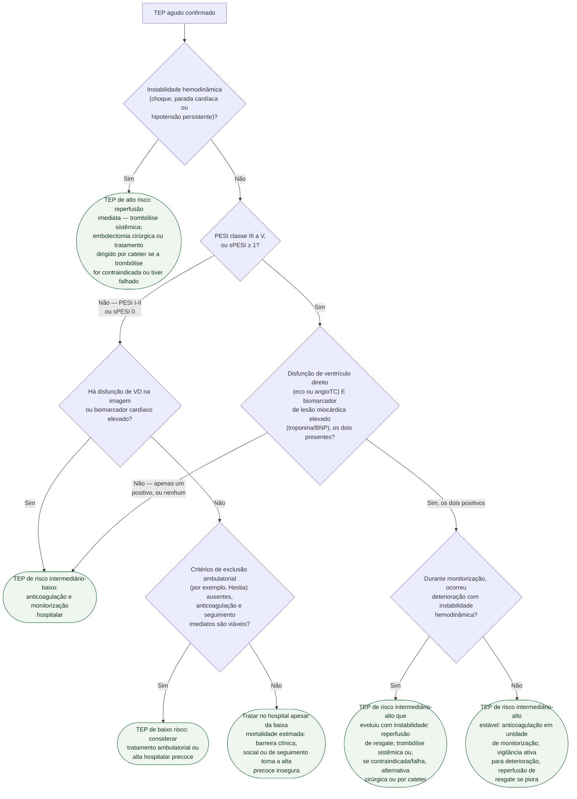

# Fluxograma: TEP agudo — estratificação de risco e decisão de trombólise

Confirmado o diagnóstico de TEP agudo, a pergunta muda de "é TEP?" para "qual
o risco de morte precoce, e isso muda a conduta agora?". A diretriz ESC 2019
organiza essa resposta em quatro categorias, combinando instabilidade
hemodinâmica, o escore clínico PESI (ou sua versão simplificada, sPESI),
disfunção de ventrículo direito por imagem e biomarcador de lesão miocárdica
elevado. A trombólise sistêmica de rotina só está indicada no risco alto — no
risco intermediário-alto, ela entra como opção de resgate diante de
deterioração, não como conduta inicial.

## Árvore de decisão

## O que a árvore não mostra

**O PEITHO mostrou por que a trombólise não é rotina no risco
intermediário-alto.** No braço trombolítico houve redução de descompensação
hemodinâmica, mas às custas de aumento de sangramento maior (6,3% versus 1,2%)
e de acidente vascular cerebral hemorrágico (2,0% versus 0,2%) em relação a
placebo mais anticoagulação — é esse equilíbrio que faz a diretriz reservar a
reperfusão para deterioração, não para todo paciente de risco
intermediário-alto.

**PESI e sPESI são escores de mortalidade em 30 dias, não medem diretamente
disfunção de VD.** Um paciente com PESI I-II ou sPESI 0 que apresente disfunção
de VD ou biomarcador cardíaco elevado não deve ser chamado de baixo risco só
pelo escore; a ESC o posiciona na faixa intermediária-baixa. Além disso, alta
precoce exige critérios clínicos e sociais de elegibilidade, e não apenas PESI
baixo.

**A reperfusão de resgate não é indicada por taquicardia ou lactato isolados.**
No risco intermediário-alto, esses achados exigem vigilância estreita, mas a
recomendação de resgate se aplica quando há deterioração hemodinâmica. A via
alternativa à trombólise sistêmica depende de contraindicações, falha do
fibrinolítico, disponibilidade e experiência do centro.

**Filtro de veia cava inferior** não aparece como ramo desta árvore por ser
reservado a contraindicação absoluta de anticoagulação, cenário à parte da
decisão de reperfusão que esta árvore resolve.
