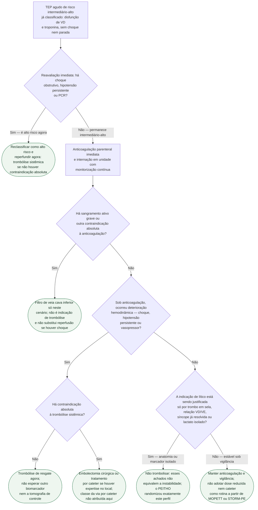

# Fluxograma: TEP de risco intermediário-alto — reperfusão versus anticoagulação

Árvore da **decisão de reperfusão** no adulto com TEP agudo **já classificado** como risco intermediário-alto: disfunção de ventrículo direito na imagem **e** troponina elevada, **sem** choque, parada ou hipotensão persistente. Não diagnostica TEP. Não calcula PESI. Não percorre as quatro classes da ESC — isso está em `fluxograma-tep-agudo-estratificacao-de-risco-e-decisao-de-trombolise`. As folhas são próximos caminhos, não atestados.

O PEITHO (tenecteplase vs. placebo, ambos com heparina; 1.005 pacientes na ITT) é o ensaio deste recorte: o lítico reduz morte ou descompensação em 7 dias (2,6% vs. 5,6%) sem reduzir morte isolada e com mais sangramento extracraniano (6,3% vs. 1,2%) e mais AVC (2,4% vs. 0,2%). Por isso a árvore só autoriza reperfusão **depois** da deterioração, ou se a reavaliação mostrar que o rótulo intermediário-alto estava errado.

## Árvore de decisão

## Como ler a árvore

- **A raiz já pressupõe a classe.** Se o PESI ainda não foi cruzado com VD e troponina, esta não é a árvore certa — volte à estratificação completa.
- **Oxigênio, suporte de VD e PERT** valem em qualquer ramo e por isso ficam fora do diagrama. PERT organiza a decisão; não é, por si, indicação de lítico.
- **C1** existe porque o rótulo intermediário-alto é dinâmico: a primeira medição de pressão pode estar desatualizada. Alto risco não espera o eco de 4 da manhã.
- **C3** é o resgate do PEITHO e da ESC 2019 (no corpus: Classe I, B — **LIMITE DA EVIDÊNCIA DISPONÍVEL** contra a tabela original). O tempo médio até descompensação no braço placebo, no texto ESC/ERS, é da ordem de 1,8 dia: a vigilância das primeiras 48 h não é teatro.
- **C4** não inventa classe para cateter nem para cirurgia. O texto narrativo da ESC 2019 trata as duas como alternativas quando o lítico é contraindicado ou falhou, **se houver expertise**. STORM-PE e PEERLESS/HI-PEITHO não tornam C4 a folha do paciente estável.
- **C5** é a folha do erro mais comum deste recorte: sela, carga trombótica e VD dilatado **já estavam** nos critérios de inclusão do PEITHO.
- **C6** recusa MOPETT (dose reduzida, ensaio pequeno e aberto) e STORM-PE (desfecho de imagem em 100 pacientes) como padrão. PEITHO-3 segue em andamento.

## O que a árvore não decide

- Qual heparina (não fracionada vs. baixo peso) e quando passar a DOAC — documentos de anticoagulação desta pasta.
- Contraindicações absolutas e relativas à fibrinólise, listadas na Table 10 da ESC (AVC hemorrágico prévio, AVC isquêmico em 6 meses, neoplasia de SNC, trauma/cirurgia/TCE em 3 semanas, diátese, sangramento ativo; relativas no protocolo).
- Categoria AHA/ACC D1–D2: hipotensão transitória ± hipoperfusão pode justificar **considerar** terapia avançada em decisão multidisciplinar, sem mandato de trombólise sistêmica plena. Não ganhou nó próprio para não fundir duas linguagens de gravidade no mesmo losango.
- Idade, sexo feminino e >75 anos aumentam o risco hemorrágico (SBPT 2025 cita mulheres >75). Isso pesa na conversa do resgate; não muda C5 nem C6 para “lítico preventivo”.
