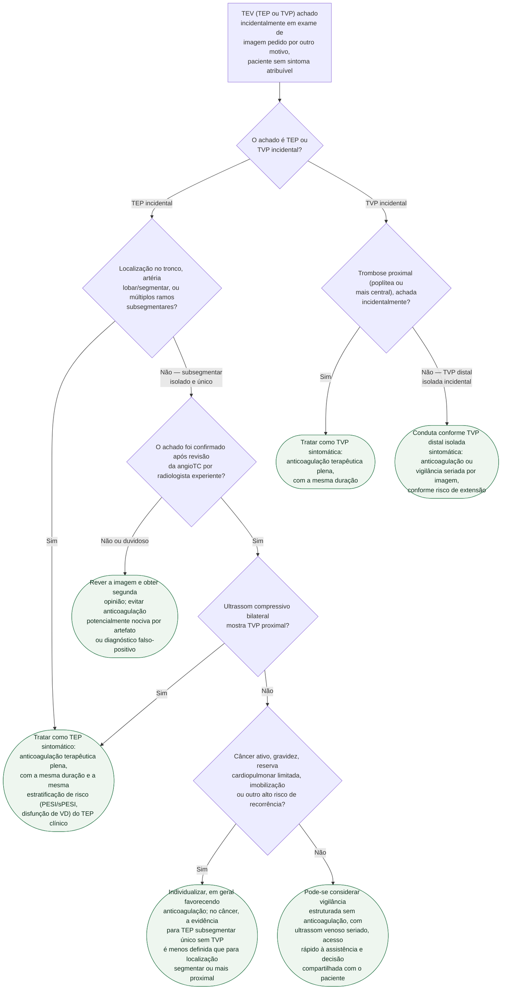

# Fluxograma: TEV incidental achado em exame de imagem

Um achado de trombo em artéria pulmonar ou em veia profunda, num exame pedido
por outro motivo — estadiamento oncológico é o cenário mais comum —, não é
automaticamente "menos grave" por ser assintomático. A diretriz ESC 2019 e as
diretrizes internacionais de TEV em câncer (ITAC) convergem num princípio: a
maioria dos achados incidentais deve ser tratada como o evento sintomático
equivalente. A exceção reconhecida e estreita é o TEP subsegmentar único, sem
fator de risco adicional, onde vigilância pode ser uma alternativa
compartilhada com o paciente.

## Árvore de decisão

## O que a árvore não mostra

**No paciente oncológico, TEP incidental segmentar ou mais proximal, múltiplos
subsegmentares, ou um subsegmentar acompanhado de TVP devem ser tratados como
o evento sintomático equivalente.** Para um único defeito subsegmentar sem TVP,
a evidência é menos definida; câncer ativo pesa a favor de anticoagular, mas a
decisão deve confirmar primeiro que o achado é real e considerar risco de
sangramento e interações.

**A leitura radiológica de "TEP subsegmentar" tem variabilidade
interobservador reconhecida.** Diante de defeito único ou duvidoso, a ESC
orienta discutir o exame com o radiologista e buscar segunda opinião para
evitar diagnóstico falso-positivo e anticoagulação desnecessária. Vigilância
sem anticoagulação só é uma opção depois de excluir TVP proximal bilateral e
garantir seguimento estruturado.

**A escolha do anticoagulante** (heparina de baixo peso molecular, DOAC ou
antagonista de vitamina K) segue os mesmos critérios do TEV sintomático —
função renal, interação medicamentosa, tipo de neoplasia — e não está
representada aqui por não ser específica do caráter incidental do achado.

**TVP incidental de membro superior associada a cateter** segue algoritmo
próprio (decisão entre remover ou manter o cateter, ao lado da anticoagulação)
e não está coberta por esta árvore, que trata do território venoso profundo de
membros inferiores e do leito pulmonar.
