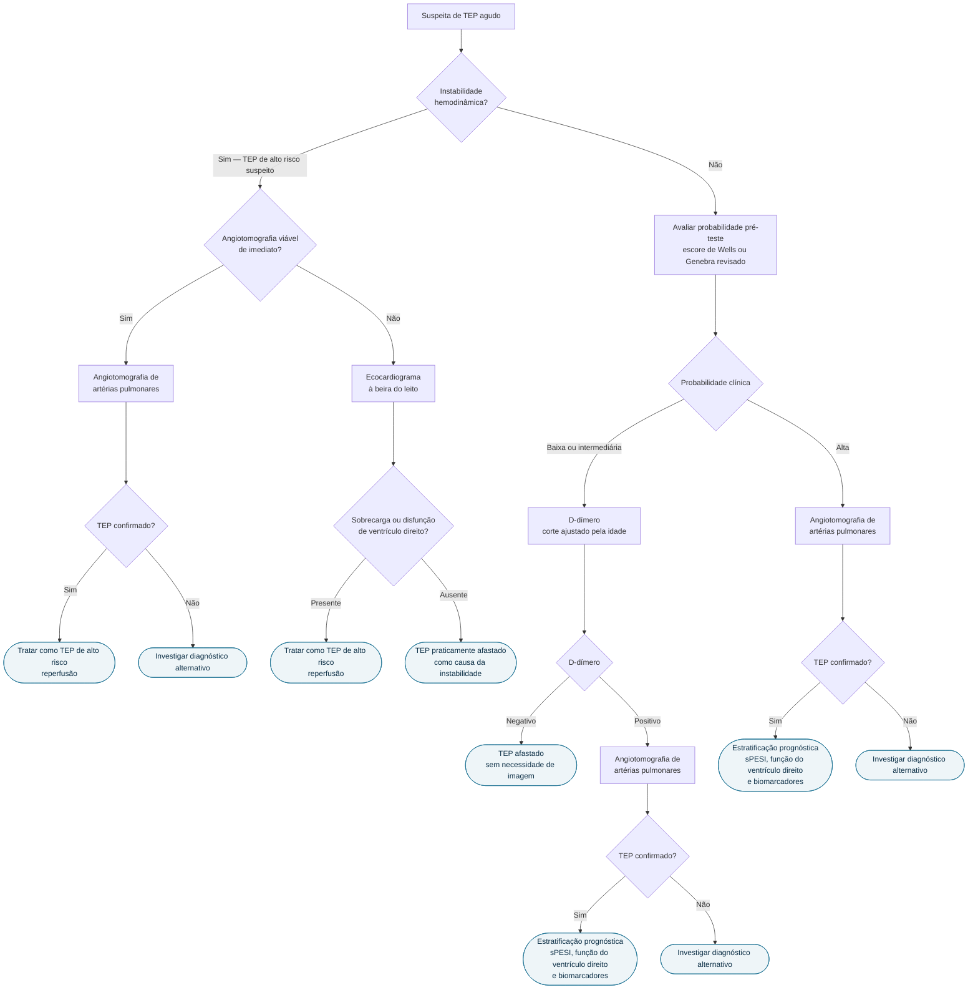

# Fluxograma: Tromboembolismo Pulmonar agudo (ESC 2019)

A diretriz ESC 2019 mantém **dois algoritmos diagnósticos distintos**, e a
bifurcação vem antes de qualquer exame: a presença ou ausência de instabilidade
hemodinâmica muda tanto a urgência quanto a ordem dos testes.

## Árvore de decisão

## O que define instabilidade hemodinâmica

A diretriz é explícita, e qualquer um dos três basta:

- **parada cardíaca**;
- **choque obstrutivo** — pressão arterial sistólica < 90 mmHg, ou necessidade de
  vasopressor para atingir PAS ≥ 90 mmHg, acompanhada de hipoperfusão de
  órgão-alvo;
- **hipotensão persistente** — PAS < 90 mmHg, ou queda da PAS ≥ 40 mmHg com
  duração superior a 15 minutos, não atribuível a outra causa identificável.

## D-dímero ajustado pela idade

A especificidade do D-dímero cai progressivamente com a idade. Por isso a
diretriz recomenda o corte ajustado: **idade × 10 µg/L para pacientes acima de
50 anos**. O objetivo declarado do refinamento dos algoritmos foi aumentar a
especificidade da combinação probabilidade pré-teste + D-dímero, **limitando
angiotomografias desnecessárias**.

## O valor do ecocardiograma no instável

No paciente hemodinamicamente instável, o ecocardiograma tem um papel que a
angiotomografia não substitui quando o transporte é inviável: a **ausência de
sinais de sobrecarga ou disfunção do ventrículo direito praticamente afasta o
TEP como causa da instabilidade**, redirecionando a investigação.

## Estratificação depois do diagnóstico

A avaliação prognóstica inicial é recomendada em todo paciente com TEP suspeito
ou confirmado, e combina parâmetros clínicos — incluindo o **sPESI** —, a função
do ventrículo direito, a hemodinâmica e os biomarcadores elevados. Não é um
único escore que decide, é a convergência desses eixos.
