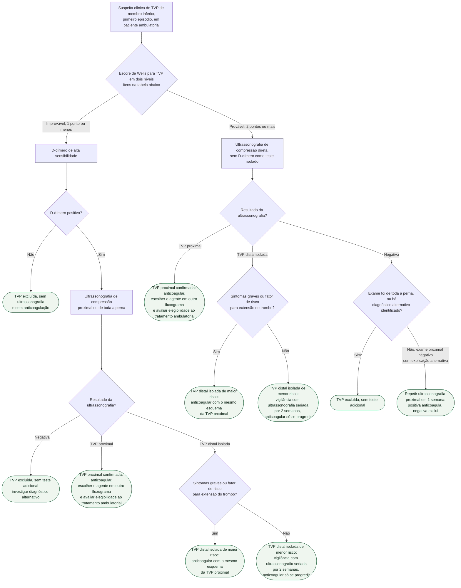

# Fluxograma: Suspeita de trombose venosa profunda — Wells, D-dímero e ultrassonografia de compressão

A suspeita de trombose venosa profunda (TVP) de membro inferior é uma das queixas em que o exame físico isolado erra mais, nos dois sentidos: a maioria das pernas dolorosas e edemaciadas não tem trombo, e uma TVP proximal não tratada pode embolizar. O que resolveu o problema foi ordenar os testes pela probabilidade clínica. No ensaio de Wells (2003), pacientes classificados como "improvável" pelo escore e com D-dímero negativo ficaram sem ultrassonografia, e o desfecho tromboembólico em 3 meses nesse grupo foi de 0,4%, contra 1,4% no grupo controle que fez imagem em todos — com 39% dos pacientes do braço D-dímero dispensados da ultrassonografia. A diretriz ASH 2018 organiza a mesma lógica por prevalência esperada: D-dímero primeiro na população de baixa probabilidade, imagem direta na de alta, e ultrassonografia seriada quando um exame proximal negativo não basta. A árvore abaixo segue essa sequência e termina onde a decisão de tratar começa; a escolha do anticoagulante e a duração ficam em outros fluxogramas.

## Árvore de decisão

## O escore de Wells para TVP

Os itens abaixo são os do modelo clínico usado no ensaio de Wells 2003, na versão em dois níveis, conforme a tabela reproduzida em van Dam 2020 (J Thromb Haemost). Somam-se os pontos; a interpretação é dicotômica.

| Item clínico | Pontos |
|---|---|
| Câncer ativo (em tratamento, tratado nos últimos 6 meses ou paliativo) | +1 |
| Paralisia, paresia ou imobilização gessada recente de membro inferior | +1 |
| Acamado recentemente por mais de 3 dias, ou cirurgia de grande porte nas últimas 12 semanas | +1 |
| Dor localizada ao longo do trajeto do sistema venoso profundo | +1 |
| Edema de toda a perna | +1 |
| Aumento da panturrilha maior que 3 cm em relação à perna assintomática | +1 |
| Edema com cacifo confinado à perna sintomática | +1 |
| Veias superficiais colaterais não varicosas | +1 |
| TVP previamente documentada | +1 |
| Diagnóstico alternativo tão ou mais provável que TVP | −2 |

| Total | Categoria | O que a árvore faz |
|---|---|---|
| ≤ 1 | TVP improvável | D-dímero primeiro |
| ≥ 2 | TVP provável | Ultrassonografia direta |

A ASH 2018 não escreve os ramos em termos de Wells, e sim de prevalência esperada de TVP: baixa (≤ 10%), intermediária (25%, ± 10%) e alta (≥ 50%). O próprio documento diz que, quando se usa regra em dois níveis, a recomendação de baixa probabilidade corresponde à categoria "TVP improvável". O acervo já registra o mesmo escore e a mesma dicotomia no documento de diagnóstico e tratamento de TVP desta pasta (ver trombose-venosa-profunda-diagnostico-e-tratamento).

## Ramo improvável: D-dímero exclui, imagem só se positivo

Na população de baixa probabilidade, a ASH 2018 recomenda começar pelo D-dímero (recomendação forte, certeza moderada quanto aos efeitos do D-dímero) e reservar a ultrassonografia proximal ou de toda a perna a quem precisar de teste adicional (esta etapa com recomendação condicional, certeza muito baixa quanto aos efeitos da ultrassonografia). Duas condições valem para o ramo inteiro: o ensaio precisa ser de alta sensibilidade, e o D-dímero negativo encerra a investigação — sem imagem e sem anticoagulação. Um D-dímero positivo nunca diagnostica TVP sozinho (recomendação 5b); ele só abre a porta para a imagem. Na mesma recomendação 5b, a ASH orienta não fazer teste adicional depois de ultrassonografia proximal ou de toda a perna negativa nessa população — por isso, no ramo improvável, o exame negativo é folha, e não há repetição em 1 semana.

Essa é exatamente a estratégia testada por Wells 2003: 1.096 pacientes ambulatoriais randomizados para ultrassonografia em todos (530) ou D-dímero seguido de ultrassonografia, exceto quando o D-dímero era negativo e o paciente "improvável" (566). Prevalência global de TVP ou TEP de 15,7%; entre os pacientes em que a TVP foi excluída pela estratégia inicial, houve 0,4% de eventos em 3 meses no braço D-dímero (IC95% 0,05 a 1,5%) e 1,4% no controle (IC95% 0,5 a 2,9%; p = 0,16). A média de ultrassonografias por paciente caiu de 1,34 para 0,78.

## Ramo provável: imagem direta e o problema do exame proximal negativo

Na população de alta probabilidade, a ASH 2018 sugere (recomendação condicional, certeza muito baixa) começar pela ultrassonografia proximal ou de toda a perna, e recomenda contra usar um D-dímero positivo isolado para diagnosticar TVP (7b). Um D-dímero negativo nesse grupo não é valorizado como teste de exclusão: no protocolo do Wells 2003, o paciente "provável" fazia imagem mesmo com D-dímero negativo. A pergunta que muda a conduta é o que fazer quando a ultrassonografia proximal é negativa. A ASH define ultrassonografia seriada como um exame adicional em 1 semana após o inicial, e a recomenda quando o exame proximal inicial é negativo e não há diagnóstico alternativo identificado. Se o exame foi de toda a perna e negativo, não é preciso teste adicional. Enquanto se espera a repetição, o paciente fica sem anticoagulação, com orientação de retorno imediato se piorar.

Na população intermediária (Wells em três níveis, não usada nesta árvore), a ASH aceita tanto a estratégia por imagem quanto a estratégia por D-dímero, esta última quando a prevalência local for de cerca de 15% ou menos.

## TVP confirmada: anticoagular e decidir onde tratar

Na TVP proximal confirmada, a conduta é anticoagular. A escolha do agente sai desta árvore e tem fluxograma próprio no acervo (fluxograma-escolha-do-anticoagulante-no-tev-doac-varfarina-ou-hbpm): a CHEST 2021 recomenda apixabana, dabigatrana, edoxabana ou rivaroxabana em vez de antagonista da vitamina K na fase de tratamento, os primeiros 3 meses (recomendação forte, certeza moderada), com as exceções por câncer ativo, gestação, síndrome antifosfolípide e insuficiência renal grave descritas no documento de TVP do acervo (ver doac-no-tratamento-do-tev-agudo-amplify-einstein-pe-re-cover-e-hokusai-vte e apixabana-rivaroxabana-dose-bula-brasil-2025-arvore-de-decisao). Para a duração, ver fluxograma-duracao-da-anticoagulacao-apos-tev-nao-provocado.

O tratamento ambulatorial da TVP depende de estabilidade clínica, baixo risco de sangramento, função renal e hepática compatíveis com o anticoagulante, adesão esperada, apoio e acesso rápido ao sistema de saúde. A árvore pede essa avaliação, mas não atribui à CHEST 2021 uma classe específica de tratamento domiciliar da TVP.

## TVP distal isolada: anticoagular ou vigiar

A CHEST 2021 define TVP distal isolada como trombo em veia profunda do membro inferior cuja extensão mais proximal fica abaixo da veia poplítea, e trata a decisão como uma escolha entre anticoagular e repetir a ultrassonografia. Declaração 1: sem sintomas graves e sem fator de risco para extensão, sugere ultrassonografia seriada das veias profundas por 2 semanas em vez de anticoagulação (recomendação fraca, certeza moderada); com sintomas graves ou fator de risco para extensão, sugere anticoagulação em vez de imagem seriada (fraca, certeza baixa). Vigilância seriada significa repetir o exame uma vez por semana, ou antes se piorar, por 2 semanas. Declaração 2, para quem está em vigilância: sem extensão, não anticoagular (forte, certeza moderada); extensão confinada às veias distais, sugere anticoagular (fraca, certeza muito baixa); extensão para veia proximal, anticoagular (forte, certeza moderada). Quem é anticoagulado usa o mesmo esquema da TVP proximal. Pacientes com alto risco de sangramento tendem a se beneficiar mais da vigilância; quem valoriza evitar exames repetidos e aceita o risco hemorrágico tende a preferir anticoagular de início.

Fatores de maior risco de extensão incluem D-dímero positivo, trombo extenso ou próximo das veias proximais, ausência de fator provocador reversível, câncer ativo, TEV prévio e internação. Sem sintomas intensos nem esses fatores, a CHEST orienta ultrassom seriado por 2 semanas; se houver progressão, anticoagular. A evidência quantitativa está em trombose-venosa-profunda-distal-isolada-duracao-da-anticoagulacao-e-vigilancia.

## Limitações e o que confirmar

- A árvore é para primeiro episódio em paciente ambulatorial. Suspeita de TVP recorrente ipsilateral, gestação, membro superior e paciente internado têm prevalência e desempenho de teste diferentes e não estão representados; o documento de TVP do acervo traz a orientação para gestação.
- A ASH 2018 formula os ramos por prevalência esperada (≤ 10%, 25%, ≥ 50%), não por escore de Wells; a equivalência "improvável = baixa probabilidade" está no texto da própria diretriz, mas a categoria intermediária do Wells em três níveis não tem ramo nesta árvore.
- A árvore não atribui classe ou nível ao tratamento domiciliar; a elegibilidade depende das condições clínicas e do acesso ao seguimento.
- Os fatores de extensão são usados como conjunto clínico, não como escore validado.
- O corte do D-dímero depende do ensaio e do laboratório; a ASH exige ensaio de alta sensibilidade, e nenhum valor numérico de corte foi conferido nesta sessão. Ajuste por idade foi estudado sobretudo em TEP (ver fluxograma-tromboembolismo-pulmonar-diagnostico-esc-2019), não nesta árvore.
- Os números do Wells 2003 vêm do abstract completo, não do texto integral do artigo.

## Tudo com Tudo

- [Trombose Venosa Profunda: Diagnóstico e Tratamento](/biblioteca/trombose-venosa-profunda-diagnostico-e-tratamento)
- [Trombose Venosa Profunda Distal Isolada: Anticoagular ou Vigiar, e por Quanto Tempo](/biblioteca/trombose-venosa-profunda-distal-isolada-duracao-da-anticoagulacao-e-vigilancia)
- [Fluxograma: Trombose venosa superficial — quando anticoagular vs. observar](/biblioteca/fluxograma-trombose-venosa-superficial-quando-anticoagular)
- [Fluxograma: Escolha do anticoagulante no tromboembolismo venoso — DOAC, varfarina ou HBPM](/biblioteca/fluxograma-escolha-do-anticoagulante-no-tev-doac-varfarina-ou-hbpm)
- [DOAC no Tratamento do TEV Agudo: AMPLIFY, EINSTEIN-PE, RE-COVER e HOKUSAI-VTE](/biblioteca/doac-no-tratamento-do-tev-agudo-amplify-einstein-pe-re-cover-e-hokusai-vte)
- [Apixabana e rivaroxabana — seleção de dose pela bula brasileira 2025](/biblioteca/apixabana-rivaroxabana-dose-bula-brasil-2025-arvore-de-decisao)
- [Fluxograma: Duração da anticoagulação após primeiro episódio de TEV não provocado](/biblioteca/fluxograma-duracao-da-anticoagulacao-apos-tev-nao-provocado)
