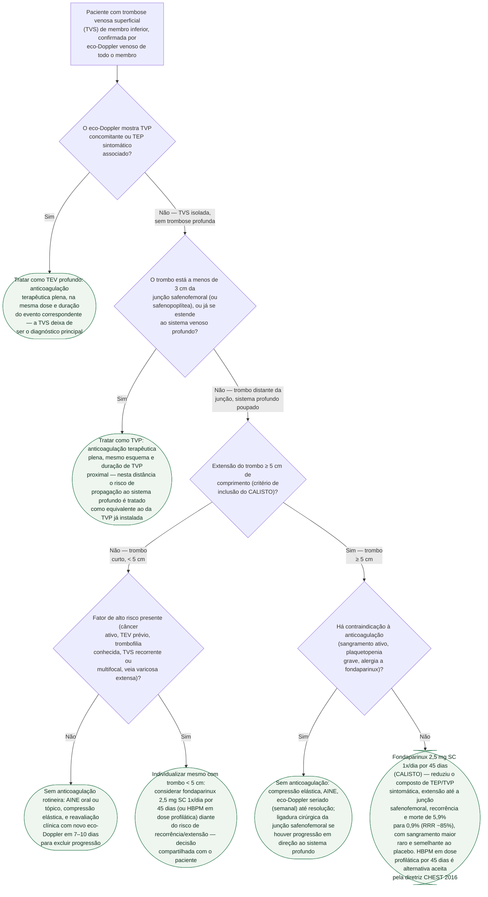

# Fluxograma: Trombose venosa superficial — quando anticoagular vs. observar

A trombose venosa superficial (TVS) do membro inferior — cordão palpável,
doloroso, eritematoso, ao longo do trajeto de uma veia superficial, tipicamente
varicosa — foi por décadas tratada como condição benigna e autolimitada,
manejada só com anti-inflamatório e compressão. O ensaio CALISTO (2010) mudou
essa leitura ao mostrar que a TVS de comprimento relevante carrega risco real
de progressão para trombose venosa profunda (TVP) e tromboembolismo pulmonar
(TEP), e que a anticoagulação em dose profilática por 45 dias reduz esse risco
de forma expressiva. A diretriz CHEST 2016 incorporou esse resultado como
recomendação formal, e a diretriz ESVS 2021 detalhou os critérios que separam
quem só precisa de vigilância de quem deve ser tratado como TVP. A árvore
abaixo organiza essa decisão em três eixos sucessivos: existe trombose
profunda concomitante, o trombo está perto demais da junção safenofemoral (ou
safenopoplítea), e o trombo é longo o suficiente para justificar anticoagulação
em dose profilática.

## Árvore de decisão

## O que a árvore não mostra

**O eco-Doppler de rastreio precisa avaliar o membro inteiro, não só o
segmento sintomático.** O CALISTO e as diretrizes que o incorporaram partem de
TVS já confirmada por imagem, com o sistema profundo formalmente examinado —
até um quarto dos casos de TVS tem TVP concomitante ao diagnóstico, muitas
vezes assintomática, e é essa checagem inicial que decide o primeiro ramo da
árvore.

**O critério de "3 cm da junção" não é um número exato e universal** — é a
forma como a literatura opera o conceito de proximidade que ameaça o sistema
profundo, e a distância exata pode variar entre o texto de diferentes
diretrizes. Diante de trombo próximo à junção mas com medida limítrofe, a
decisão de tratar como TVP em vez de aplicar o ramo de dose profilática tende
a pesar para o lado mais cauteloso, sobretudo se houver qualquer sinal
ecográfico de fluxo comprometido na junção.

**TVS recorrente ou migratória (tromboflebite migratória)** é achado clássico
associado a neoplasia oculta (síndrome de Trousseau) e, nesse cenário, costuma
justificar investigação oncológica dirigida por idade e fatores de risco — a
mesma lógica de rastreio de câncer oculto já usada após TEV não provocado,
não representada nesta árvore por ser uma investigação paralela, não um ramo
de conduta imediata da TVS.

**TVS em veia não varicosa** (veia superficial de calibre normal, sem
doença varicosa de base) tem associação mais forte com trombofilia e neoplasia
do que a TVS que ocorre sobre uma variz já conhecida — é um sinal de alerta
adicional para investigar causa subjacente, sem mudar a árvore de decisão
terapêutica em si.

**Tromboflebite séptica** (sinais infecciosos francos — febre, calafrio,
secreção purulenta no trajeto, geralmente associada a cateter venoso
periférico) é uma entidade distinta, que exige antibioticoterapia e, com
frequência, remoção cirúrgica do segmento infectado — não está coberta por
esta árvore, que trata da TVS espontânea/varicosa.

**A doença de Mondor** (TVS da parede torácica ou mamária) segue princípio
semelhante de conduta conservadora com AINE na maioria dos casos, mas por
localização e mecanismo distintos (trauma local, pós-cirúrgico, raramente
associada a neoplasia de mama) não está representada nesta árvore, construída
para o território de membro inferior que sustenta o corpo de evidência do
CALISTO e das diretrizes citadas.

**A escolha entre fondaparinux e HBPM em dose profilática** segue
disponibilidade e preferência local — a diretriz CHEST 2016 expressa
preferência pelo fondaparinux sobre a HBPM profilática nesse cenário
específico, mas trata as duas como opções aceitáveis, e a diferença não muda
nenhum ramo desta árvore.
