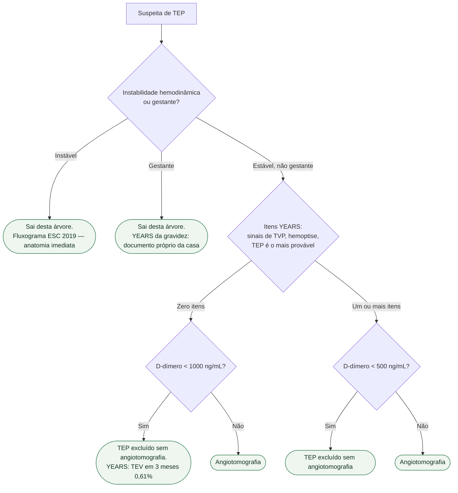

# Fluxograma: algoritmo YEARS na suspeita de TEP no paciente estável

O fluxograma ESC 2019 da casa decide **instável vs estável**. Esta árvore só abre no estável, como alternativa ao Wells + D-dímero.

## Mensagem prática

**Estável, não gestante: 3 itens. Zero itens corta em 1000; algum item corta em 500. O resto vai à tomografia.** Instável não espera D-dímero.
