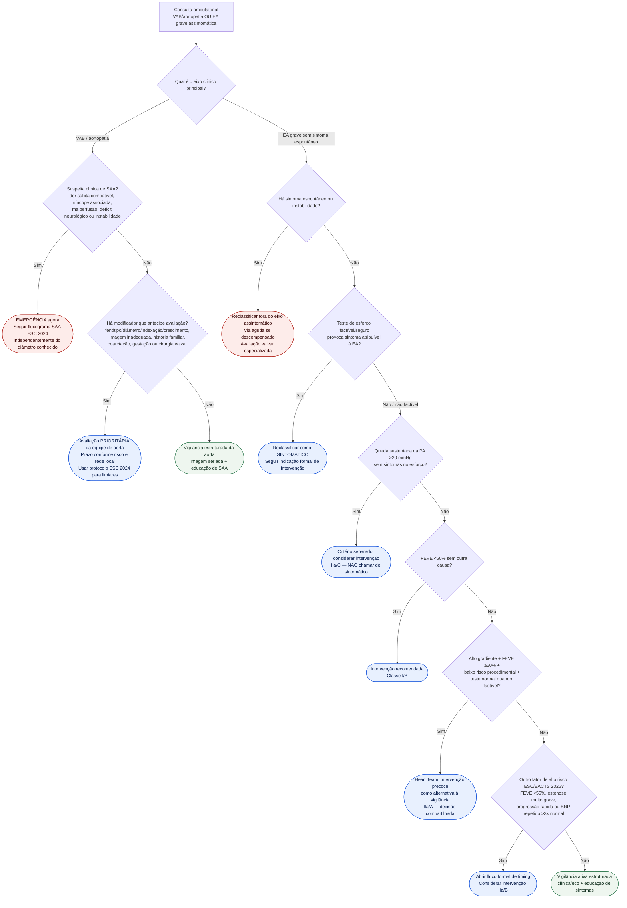

# Fluxograma ambulatorial: aortopatia em VAB e EA grave assintomática

Prosa VAB: [`sinalizadores-ambulatoriais-de-aortopatia-em-valva-aortica-bicuspide-quando-escalar`](sinalizadores-ambulatoriais-de-aortopatia-em-valva-aortica-bicuspide-quando-escalar.md).

Prosa EA: [`sinalizadores-ambulatoriais-de-estenose-aortica-assintomatica-grave-vigilancia`](sinalizadores-ambulatoriais-de-estenose-aortica-assintomatica-grave-vigilancia.md).

Fluxo formal de EA: [`fluxograma-estenose-aortica-assintomatica-grave-timing-de-intervencao-esc-eacts-2025`](fluxograma-estenose-aortica-assintomatica-grave-timing-de-intervencao-esc-eacts-2025.md).

Fluxo formal de SAA: [`fluxograma-sindrome-aortica-aguda-esc-2024`](../Aorta_e_doença_arterial_periférica/fluxograma-sindrome-aortica-aguda-esc-2024.md).

## Árvore de decisão

## Notas

- VAB/aortopatia e EA grave assintomática compartilham anatomia valvar, mas **não devem ser fundidas semanticamente** em relações clínicas fortes sem nexo específico.
- Assimetria de pulsos/PA isolada não é diagnóstico de SAA; ganha peso quando acompanha quadro compatível.
- O eixo EA usa a **diretriz ESC/EACTS 2025** já incorporada ao corpus e preserva a hierarquia de classes.
- Não há prazo universal de “dias” para Heart Team/equipe de aorta; prioridade é proporcional ao risco.
