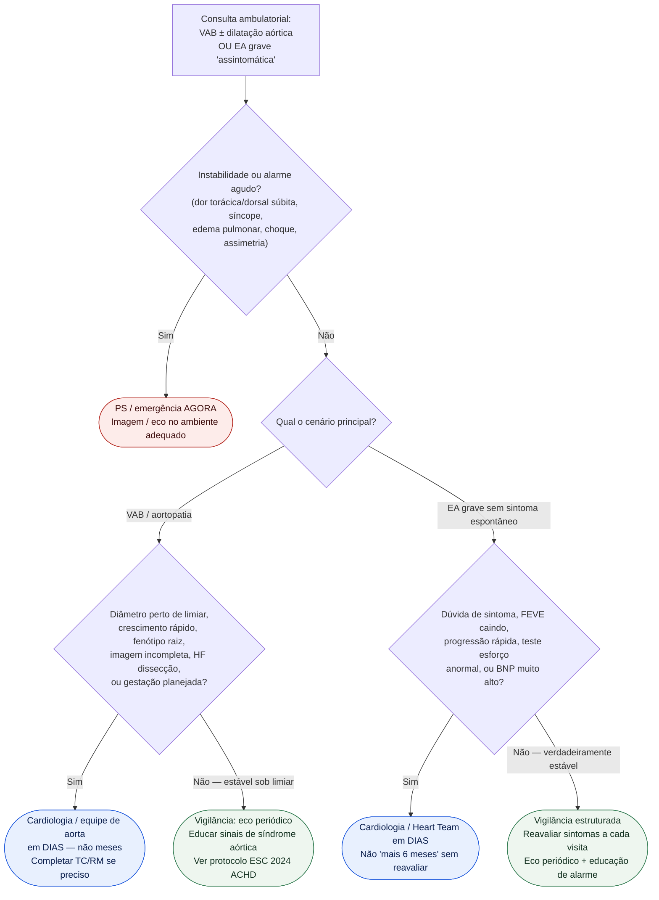

# Fluxograma ambulatorial: aortopatia em VAB e EA assintomática grave — quando escalar

Prosa: [`sinalizadores-ambulatoriais-de-aortopatia-em-valva-aortica-bicuspide-quando-escalar`](sinalizadores-ambulatoriais-de-aortopatia-em-valva-aortica-bicuspide-quando-escalar.md) e [`sinalizadores-ambulatoriais-de-estenose-aortica-assintomatica-grave-vigilancia`](sinalizadores-ambulatoriais-de-estenose-aortica-assintomatica-grave-vigilancia.md).

Complementa (não substitui) [`fluxograma-ambulatorial-valvopatia-quando-escalar-para-heart-team`](fluxograma-ambulatorial-valvopatia-quando-escalar-para-heart-team.md) (#840) e os fluxogramas de **timing** de intervenção na EA assintomática já na pasta.

## Árvore de decisão

## Notas

- **D1** = gate de segurança (síndrome aórtica / EA descompensando).
- **D3** = destino da aortopatia VAB (ESC 2024 PMID 39210722) — limiares finos no protocolo ACHD, não nesta árvore.
- **D4** = red flags da EA “assintomática” (ESC/EACTS 2021 PMID 34453165) antes da árvore completa de Classes I/IIa.
- Não escolhe TAVI/SAVR, técnica de raiz nem doses; não compete com hubs #717/#718.
