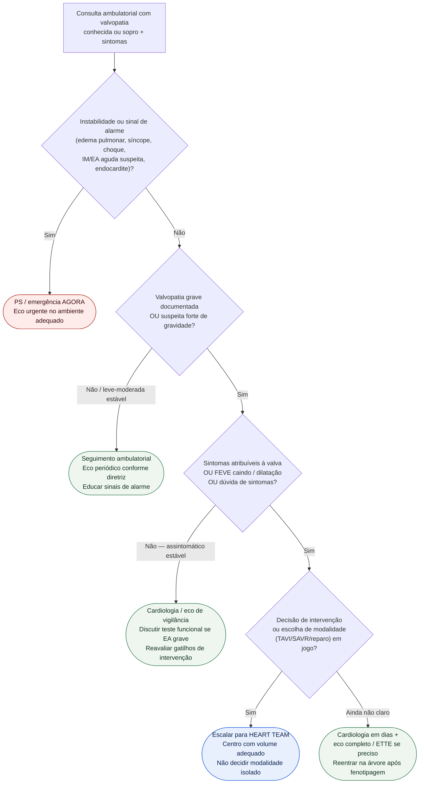

# Fluxograma ambulatorial: valvopatia — quando escalar para Heart Team

Prosa: [`sinalizadores-ambulatoriais-de-estenose-aortica-sintomatica-quando-encaminhar`](sinalizadores-ambulatoriais-de-estenose-aortica-sintomatica-quando-encaminhar.md) e [`sinalizadores-ambulatoriais-de-insuficiencia-mitral-descompensando`](sinalizadores-ambulatoriais-de-insuficiencia-mitral-descompensando.md).

ESC/EACTS 2021 e ACC/AHA 2020 situam o **Heart Team** como nó central quando há indicação potencial de intervenção ou anatomia/risco complexos.

## Árvore de decisão

## Notas

- **D1** = gate de segurança (alarme agudo).
- **D3** = o que muda o destino na EA/IM graves nas diretrizes (sintomas, função/dilatação, sintomas duvidosos).
- **D4 / C4** = Heart Team quando intervenção está sobre a mesa (ESC/EACTS 2021; ACC/AHA 2020).
- Não escolhe prótese, anticoagulação nem doses; não compete com hubs de doença abertos.
