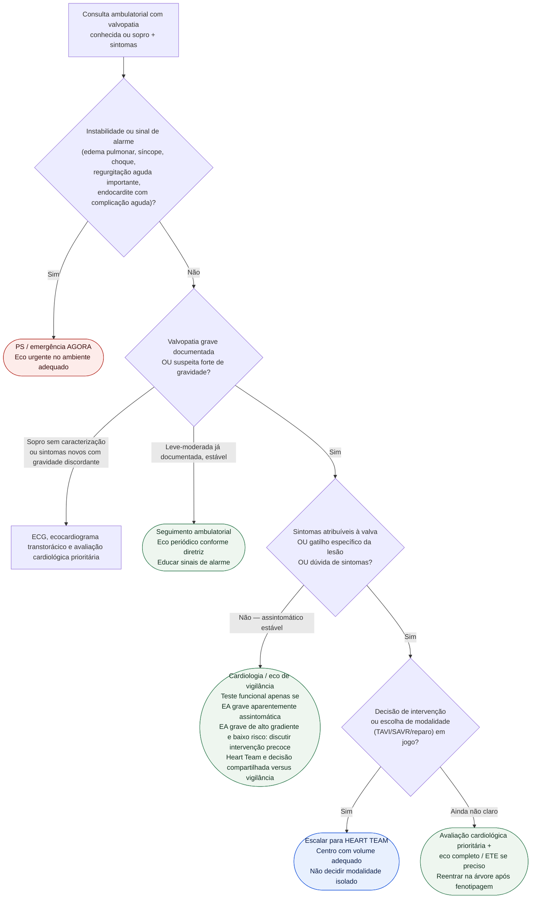

# Fluxograma ambulatorial: valvopatia — quando escalar para Heart Team

Prosa: [sinalizadores-ambulatoriais-de-estenose-aortica-sintomatica-quando-encaminhar](/biblioteca/sinalizadores-ambulatoriais-de-estenose-aortica-sintomatica-quando-encaminhar) e [sinalizadores-ambulatoriais-de-insuficiencia-mitral-descompensando](/biblioteca/sinalizadores-ambulatoriais-de-insuficiencia-mitral-descompensando).

ESC/EACTS 2025 e ACC/AHA 2020 situam o **Heart Team** como nó central quando há indicação potencial de intervenção ou anatomia/risco complexos.

## Árvore de decisão

## Notas

- **D1** = gate de segurança. Suspeita de endocardite sem instabilidade exige via diagnóstica urgente estruturada no mesmo dia, com hemoculturas/eco conforme contexto; PS se houver complicação aguda ou se essa avaliação não for acessível. Não aguardar consulta eletiva.
- **D3** = o que muda o destino na EA/IM graves nas diretrizes (sintomas e critérios específicos por valvopatia; dilatação isolada não é gatilho genérico de EA).
- **D4 / C4** = Heart Team quando intervenção está sobre a mesa (ESC/EACTS 2025; ACC/AHA 2020).
- Não escolhe prótese, anticoagulação nem doses; não compete com hubs de doença abertos.
